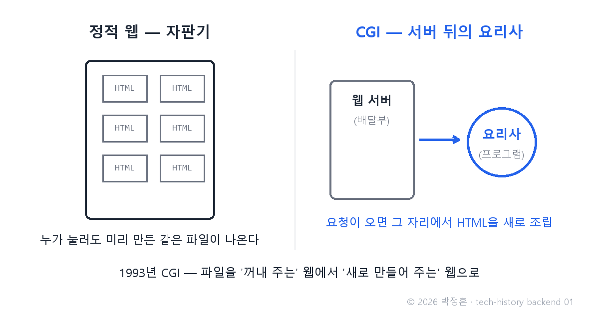
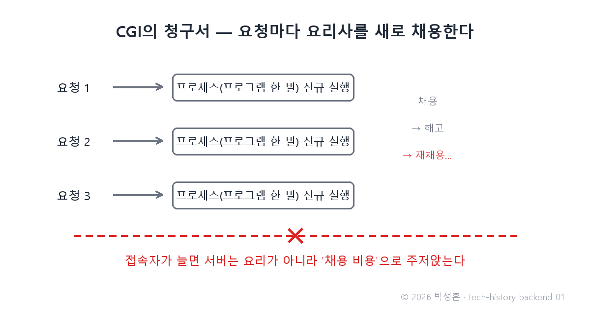

# [발행 1/12] 1993년 CGI — 방명록 하나 못 만들던 웹, 서버가 요리를 시작했다

- 원본: [02-backend.md](./02-backend.md) Part 1 중 정적 웹·CGI · 발행: 1번째 · 편성: [plan.md](./plan.md)

| # | 이미지 | 삽입 위치 |
|---|---|---|
| 1 | `images/01-1-vending-vs-kitchen.png` | 대표 (첫 첨부) |
| 2 | `images/01-2-cgi-process-cost.png` | 새로운 문제 대목 직후 |

---

## LinkedIn 본문

[테크스토리 백엔드 #01 | 1993년 CGI — 방명록 하나 못 만들던 웹, 서버가 요리를 시작했다]

1993년의 웹사이트에는 방명록도, 방문자 카운터도, 검색창도 없었습니다. 안 만든 게 아니라, 만들 수가 없었습니다.

기술의 역사를 "문제 → 해결 → 새로운 문제"의 연쇄로 풀어가는 시리즈 — 프론트엔드 11편에 이은 두 번째 시리즈, 백엔드 편을 시작합니다.
(등장인물과 대화는 이해를 돕기 위한 각색이며, 기술 내용은 모두 실제 기록입니다.)

무대는 미국 일리노이 대학의 슈퍼컴퓨팅 연구소 NCSA — 프론트엔드 편에서 브라우저 Mosaic이 태어난 바로 그곳입니다. 이번엔 반대편, 서버 쪽 이야기입니다.

운영자: "홈페이지에 방명록을 달고 싶어. 방문자가 글을 남기면 다음 사람이 볼 수 있게."

개발자: "안 돼. 서버는 미리 만들어 둔 파일을 꺼내 주는 기계야. A가 글을 남겨도 파일은 그대로니까, B의 화면엔 아무것도 안 나타나."

운영자: "그럼 서버가 그때그때 페이지를 새로 만들면 되잖아?"

개발자: "그게 바로 서버 뒤에 요리사를 두자는 얘기지."

이 시절의 웹 서버는 자판기였습니다. 버튼(주소)을 누르면 미리 만들어 둔 상품(HTML 문서)이 나올 뿐, 즉석 조리는 못 합니다. 누가 누르든 같은 상품이 나오죠.

해결: 1993년 NCSA가 CGI(Common Gateway Interface — 웹 서버와 외부 프로그램 사이의 표준 연결 규약)를 고안합니다. 서버가 요청을 받으면 뒤에 있는 프로그램(요리사)을 실행시키고, 그 프로그램이 그 자리에서 만들어 낸 HTML을 손님에게 돌려주는 방식입니다. 파일을 "꺼내 주는" 웹에서 "새로 조립해 주는" 웹으로 — 방명록, 카운터, 폼 처리가 이때 비로소 가능해졌습니다.

미리 만든 파일 그대로의 웹(정적 웹)이 어떤 모습이었는지는 지금도 직접 볼 수 있습니다. 1996년 영화 스페이스 잼의 공식 사이트가 spacejam.com/1996 주소에 원형 그대로 살아 있거든요. 워너브라더스가 2021년 신작 개봉 때도 지우지 않고 보존한, 웹의 화석 같은 페이지입니다.

새로운 문제: CGI는 요청이 올 때마다 프로그램 한 벌을 통째로 새로 켰습니다(이걸 프로세스 생성이라 합니다 — 주문이 들어올 때마다 요리사를 새로 채용했다가 요리가 끝나면 해고하는 셈). 접속자가 늘자 서버는 요리가 아니라 채용 비용 때문에 주저앉았습니다. 게다가 모든 기능을 바닥부터 직접 짜야 했죠.

그리고 동적인 웹이 열리자마자 더 근본적인 문제가 드러납니다 — 서버가 손님을 기억하지 못한다는 것.

다음 편(#02): 로그인도 장바구니도 불가능했던 이유. 23세 엔지니어가 발명한 "웹의 기억", 쿠키 이야기로 이어집니다.

(대화는 각색입니다. 출처: RFC 3875(CGI 명세) / NCSA HTTPd 기록 / Web Design Museum·Internet Archive의 스페이스 잼 1996 보존 기록)

© 2026 박정훈 · 전체 시리즈: github.com/nous-zero/tech-history

#기술의역사 #IT역사 #백엔드 #CGI #테크스토리

---

## X 본문 (이미지 01-1 첨부)

1993년 CGI가 나오기 전, 웹은 방명록 하나 못 만들었다.
서버가 미리 만든 파일만 꺼내 주는 자판기였기 때문.
서버 뒤에 요리사(외부 프로그램)를 둔 규약 CGI가 동적 웹을 열었다. (1/12)
