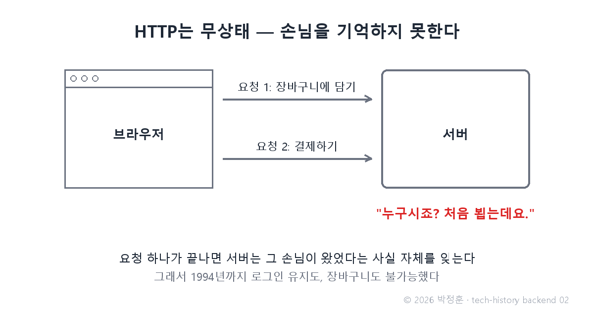
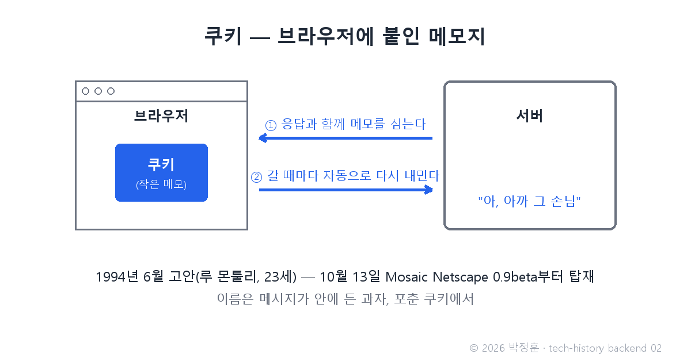

# [발행 2/12] 1994년 쿠키 — 23세 루 몬툴리가 장바구니 때문에 발명한 웹의 기억

- 원본: [02-backend.md](./02-backend.md) Part 1 중 쿠키 · 발행: 2번째 · 편성: [plan.md](./plan.md)

| # | 이미지 | 삽입 위치 |
|---|---|---|
| 1 | `images/02-1-stateless-http.png` | 대표 (첫 첨부) |
| 2 | `images/02-2-cookie-note.png` | 해결 대목 직후 |

---

## LinkedIn 본문

[테크스토리 백엔드 #02 | 1994년 쿠키 — 23세 루 몬툴리가 장바구니 때문에 발명한 웹의 기억]

1994년의 웹에는 장바구니를 만들 수 없었습니다. 물건을 담고 다음 페이지로 넘어가는 순간, 서버가 손님을 완전히 잊어버렸으니까요.

기술의 역사를 "문제 → 해결 → 새로운 문제"의 연쇄로 풀어가는 시리즈, 백엔드 편 2편입니다. (1편: 1993년 CGI — 서버가 요리를 시작했다)
(등장인물과 대화는 이해를 돕기 위한 각색이며, 기술 내용은 모두 실제 기록입니다.)

1994년 6월, 창업 직후의 넷스케이프. 23세 엔지니어 루 몬툴리에게 과제가 하나 떨어집니다.

동료: "고객사 MCI가 온라인 쇼핑 앱을 원해. 장바구니가 핵심이야."

몬툴리: "그게 문제야. HTTP는 무상태 프로토콜이거든 — 요청과 요청 사이를 기억하지 못하는 성질 말이야. 페이지 하나를 보내고 나면 서버는 그 손님이 왔었다는 사실 자체를 잊어."

동료: "담은 물건을 서버에 저장해 두면?"

몬툴리: "다음 요청이 왔을 때 그 손님이 아까 그 손님인지 알아볼 방법이 없잖아. 매번 처음 보는 얼굴이야."

몬툴리의 해결은 발상의 전환이었습니다 — 서버가 기억할 수 없다면, 손님(브라우저)에게 메모를 들려 보내자.

서버가 브라우저에 작은 데이터를 심어 두면, 브라우저가 그 서버에 갈 때마다 그 메모를 자동으로 다시 내미는 방식. 서버는 메모를 읽고 "아, 아까 그 손님"을 알아봅니다. 이름은 메시지가 안에 든 과자, 포춘 쿠키에서 따왔습니다. 1994년 10월 13일 공개된 Mosaic Netscape 0.9 베타부터 탑재됐고, 최초의 실전 용도는 넷스케이프 홈페이지의 재방문자 확인이었습니다.

이 작은 메모지 위에 로그인 유지, 장바구니, "오늘 하루 보지 않기"까지 — 우리가 아는 웹의 편의가 전부 세워졌습니다.

새로운 문제: 손님을 알아본다는 건, 손님을 추적할 수 있다는 뜻이기도 합니다. 쿠키는 오늘날까지 이어지는 프라이버시 논쟁의 출발점이 됐습니다.

이 논쟁이 얼마나 현재진행형인지 보여주는 사건이 있습니다. 구글은 2020년 크롬에서 서드파티 쿠키(내가 방문한 사이트가 아닌 제3자가 심는 쿠키 — 광고 추적의 핵심 도구)를 퇴출하겠다고 선언했다가, 4년 만인 2024년 7월 그 계획을 공식 철회했습니다. 30년 된 기술 하나를 빼내지 못하는 이유는 단순합니다 — 그만큼 웹 전체가 쿠키 위에 서 있기 때문입니다.

다음 편(#03): CGI는 어려웠고, 쿠키는 기억을 줬다. 이제 필요한 건 "쉽게 만드는 법" — 자기 이력서 조회수를 세려고 만든 개인 도구가 웹 최대의 언어가 된 이야기, PHP로 이어집니다.

(대화는 각색입니다. 출처: Lou Montulli 회고 / Guinness World Records "First use of cookies" / RFC 2109 / 구글 Privacy Sandbox 공식 발표(2024.7))

© 2026 박정훈 · 전체 시리즈: github.com/nous-zero/tech-history

#기술의역사 #IT역사 #쿠키 #프라이버시 #테크스토리

---

## X 본문 (이미지 02-2 첨부)

1994년 넷스케이프의 23세 엔지니어 루 몬툴리가 쿠키를 발명했다.
동기는 고객사의 장바구니 요구 — 아무것도 기억 못 하는 HTTP에 붙인 메모지.
30년 뒤, 구글도 이 기술을 빼내지 못했다. (2/12)
