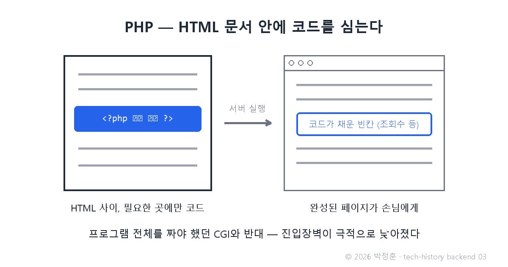
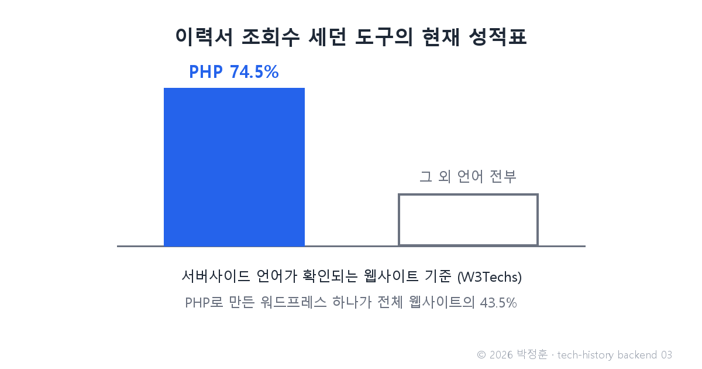

# [발행 3/12] 1995년 PHP — 이력서 조회수 세던 개인 도구가 웹의 74%를 접수했다

- 원본: [02-backend.md](./02-backend.md) Part 1 중 PHP·ASP·Servlet/JSP · 발행: 3번째 · 편성: [plan.md](./plan.md)

| # | 이미지 | 삽입 위치 |
|---|---|---|
| 1 | `images/03-1-php-embed.png` | 대표 (첫 첨부) |
| 2 | `images/03-2-php-745.png` | 점유율 대목 직후 |

---

## LinkedIn 본문

[테크스토리 백엔드 #03 | 1995년 PHP — 이력서 조회수 세던 개인 도구가 웹의 74%를 접수했다]

세계에서 가장 널리 쓰이는 서버 언어는, 한 개발자가 자기 이력서를 누가 봤는지 세려고 만든 개인 도구에서 출발했습니다.

기술의 역사를 "문제 → 해결 → 새로운 문제"의 연쇄로 풀어가는 시리즈, 백엔드 편 3편입니다. (2편: 1994년 쿠키 — 웹의 기억)
(등장인물과 대화는 이해를 돕기 위한 각색이며, 기술 내용은 모두 실제 기록입니다.)

1994년, 캐나다 출신 개발자 라스무스 러도프의 책상. 친구가 묻습니다.

친구: "온라인에 이력서를 올렸다며. 누가 보기는 하는 거야?"

러도프: "그래서 작은 프로그램을 짰어. 내 이력서 페이지를 누가 열어볼 때마다 기록이 남아."

친구: "그거 CGI로 짠 거야? 지난번에 CGI는 어렵다며."

러도프: "그래서 내 방식은 반대야. 프로그램 안에 HTML을 넣는 게 아니라, HTML 문서 안에 코드 조각을 심는 거야. 서버가 그 부분만 실행해서 빈칸을 채워 주는 거지."

문제: 1편의 CGI는 분명 동작했지만, 페이지 하나를 만들려 해도 프로그램 전체를 짜야 해서 진입장벽이 높았습니다.

해결: 러도프는 이 개인 도구를 다듬어 1995년 6월 8일 공개합니다. 이름은 Personal Home Page Tools — 말 그대로 "개인 홈페이지 도구", 지금의 PHP입니다. 문서 위주로 작성하다가 필요한 곳에만 코드를 심는 방식 덕에 진입장벽이 극적으로 낮아졌고, 평범한 사람들이 동적 웹페이지를 만들기 시작했습니다.

같은 문제를 두고 대기업들도 각자의 답을 냅니다. 마이크로소프트는 1996년 12월 ASP를 내놨고, Sun은 Java Servlet(1997)과 JSP(1999)로 응수했습니다. 특히 Java 진영은 요청마다 프로그램을 새로 켜는 대신 스레드(한 프로그램 안에서 나뉘어 일하는 여러 작업 흐름 — 새 프로그램을 통째로 켜는 것보다 훨씬 싼 방식)로 손님을 받아 CGI의 비용 문제까지 해결했고, 기업 시장을 장악했습니다.

그 개인 도구의 현재 성적표: 서버사이드 언어가 확인되는 웹사이트 기준으로 74.5%가 PHP로 돌아갑니다(W3Techs 조사). PHP로 만든 워드프레스 하나가 전체 웹사이트의 43.5%입니다. 페이스북도 PHP로 시작했습니다.

새로운 문제: HTML 안에 코드를 심는 편리함은 곧 저주가 됐습니다. 화면(HTML)과 비즈니스 로직(서비스의 핵심 규칙 — 계산·판정)이 한 파일에 뒤엉킨 스파게티 코드. 버튼 색 하나 고치려다 결제 코드를 건드리는 세상이 온 겁니다. 프론트엔드 편에서 HTML에 디자인이 섞여 CSS가 태어났듯, 똑같은 구조의 문제가 서버 쪽에서 재현됐습니다.

다음 편(#04): 이 스파게티를 자르는 칼 — "15분 만에 블로그를 만들어 보이겠다"던 한 데모가 트위터·깃허브·쇼피파이를 낳은 이야기, Ruby on Rails로 이어집니다.

(대화는 각색입니다. 출처: php.net 공식 연혁 / Wikipedia "Active Server Pages" / Java Servlet 1.0 명세 / W3Techs 서버사이드 언어 통계)

© 2026 박정훈 · 전체 시리즈: github.com/nous-zero/tech-history

#기술의역사 #IT역사 #PHP #백엔드 #테크스토리

---

## X 본문 (이미지 03-2 첨부)

PHP는 1994년 한 개발자가 자기 이력서 조회수를 세려고 만든 개인 도구였다.
지금은 서버 언어가 확인되는 웹사이트의 74.5%가 PHP(W3Techs).
웹 최대 언어의 시작은 취업 준비였다. (3/12)
