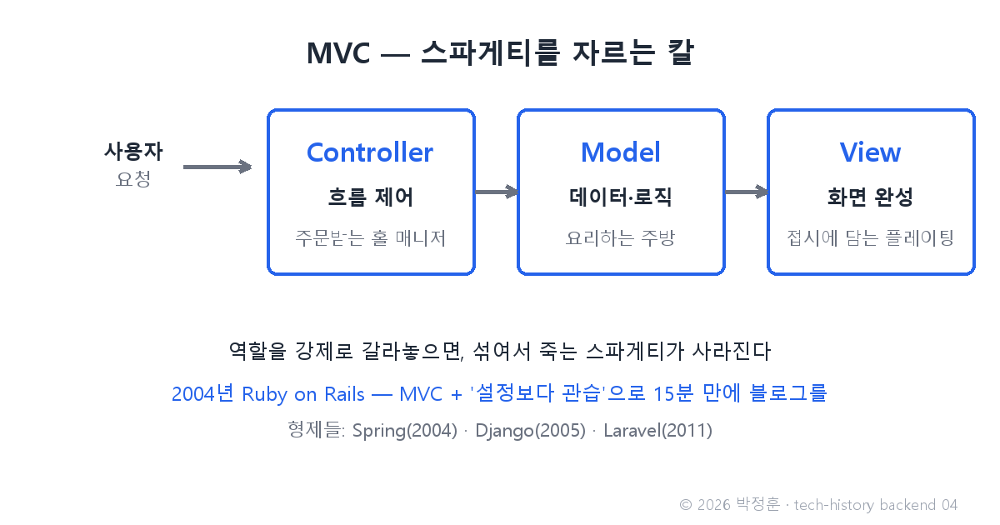
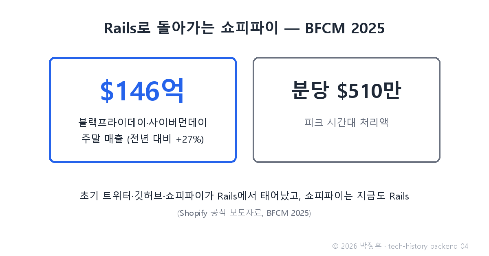

# [발행 4/12] 2004년 Ruby on Rails — 15분 블로그 데모가 낳은 트위터·깃허브·쇼피파이

- 원본: [02-backend.md](./02-backend.md) Part 2 전체 · 발행: 4번째 · 편성: [plan.md](./plan.md)

| # | 이미지 | 삽입 위치 |
|---|---|---|
| 1 | `images/04-1-mvc-restaurant.png` | 대표 (첫 첨부) |
| 2 | `images/04-2-shopify-bfcm.png` | 쇼피파이 대목 직후 |

---

## LinkedIn 본문

[테크스토리 백엔드 #04 | 2004년 Ruby on Rails — 15분 블로그 데모가 낳은 트위터·깃허브·쇼피파이]

2005년 브라질의 한 콘퍼런스. 덴마크 출신 개발자가 무대에서 선언합니다. "15분 만에 블로그를 만들어 보이겠습니다." 당시 상식으로 몇 주짜리 작업이었습니다.

기술의 역사를 "문제 → 해결 → 새로운 문제"의 연쇄로 풀어가는 시리즈, 백엔드 편 4편입니다. (3편: 1995년 PHP — 개인 도구가 웹을 접수하다)
(등장인물과 대화는 이해를 돕기 위한 각색이며, 기술 내용은 모두 실제 기록입니다.)

무대의 주인공은 데이비드 하이네마이어 한슨, 개발자들 사이의 별명은 DHH. 그가 2004년 7월 오픈소스로 공개한 Ruby on Rails의 위력을 보여주는 자리였습니다. 당시 개발자들의 대화를 재연하면 이렇습니다.

개발자 A: "말이 돼? 블로그면 DB 연결, 주소 연결, 글쓰기 폼… 준비만 며칠인데."

개발자 B: "Rails는 그 준비를 안 해. '설정보다 관습'이라고 — 정해진 규칙대로 이름만 지으면, 연결은 프레임워크가 알아서 해."

개발자 A: "코드가 뒤엉키는 건? PHP 스파게티 꼴 나는 거 아냐?"

개발자 B: "그래서 MVC를 강제해. 주문받는 홀 매니저(Controller), 요리하는 주방(Model), 접시에 담는 플레이팅(View) — 역할을 아예 갈라놨어."

문제: 웹 앱마다 반복되는 준비 작업을 매번 처음부터 해야 했고, 화면과 로직이 뒤엉키는 스파게티는 여전했습니다.

해결: Rails는 두 원칙으로 답했습니다. MVC 패턴(화면·데이터·흐름 제어의 강제 분리)과 Convention over Configuration(설정보다 관습). 개발 속도의 혁명이었고, 초기 트위터·깃허브·쇼피파이가 전부 Rails 위에서 태어났습니다. 곧 형제들이 뒤따랐습니다 — Java 진영의 Spring 1.0(2004년 3월), Python 진영의 Django(2005년 7월), PHP 진영의 Laravel(2011년 6월).

그 결과의 현재형 하나. 쇼피파이는 지금도 Rails로 돌아가는데, 2025년 블랙프라이데이·사이버먼데이 주말 매출이 146억 달러(약 20조 원 규모, 전년 대비 27% 증가), 피크 시간대엔 분당 510만 달러를 처리했습니다(쇼피파이 공식 발표).

물론 반대 방향의 교훈도 있습니다. 트위터는 폭증하는 트래픽을 감당하지 못해 이후 Scala/JVM 계열로 갈아탔습니다 — 해결이 새 문제를 낳는 연쇄는 프레임워크에도 예외가 없습니다.

새로운 문제: 프레임워크가 만들어 주는 앱은 모놀리스(한 덩어리 앱)였습니다. 작을 땐 편하지만, 트래픽과 팀이 커지면 한 줄 고치는 데도 전체를 다시 배포해야 하는 병목이 됩니다. 이 이야기는 10편에서 폭발합니다.

다음 편(#05): 서버끼리 말이 안 통하던 시대, 박사논문 한 편이 API의 문법을 정하다 — REST와 JSON 이야기로 이어집니다.

(대화는 각색입니다. 출처: rubyonrails.org 연혁 / DHH "15-minute blog" 데모(FISL 2005) / spring.io 릴리스 블로그 / djangoproject.com 20주년 타임라인 / Shopify BFCM 2025 공식 보도자료)

© 2026 박정훈 · 전체 시리즈: github.com/nous-zero/tech-history

#기술의역사 #IT역사 #RubyOnRails #프레임워크 #테크스토리

---

## X 본문 (이미지 04-2 첨부)

2005년 한 콘퍼런스에서 DHH는 15분 만에 블로그를 만들어 보였다.
Ruby on Rails — 초기 트위터·깃허브·쇼피파이가 이 위에서 태어났다.
쇼피파이는 지금도 Rails로 블프 주말 146억 달러를 처리한다. (4/12)
