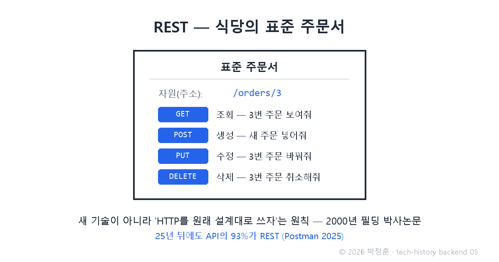
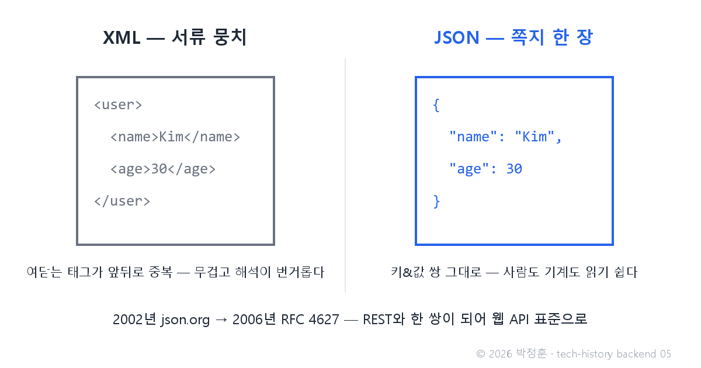

# [발행 5/12] 2000년 REST — 박사논문 한 편이 API의 문법이 되다, 그리고 JSON

- 원본: [02-backend.md](./02-backend.md) Part 3 중 REST·JSON · 발행: 5번째 · 편성: [plan.md](./plan.md)

| # | 이미지 | 삽입 위치 |
|---|---|---|
| 1 | `images/05-1-rest-order-sheet.png` | 대표 (첫 첨부) |
| 2 | `images/05-2-json-vs-xml.png` | JSON 대목 직후 |

---

## LinkedIn 본문

[테크스토리 백엔드 #05 | 2000년 REST — 박사논문 한 편이 API의 문법이 되다, 그리고 JSON]

지금 이 순간 전 세계 API의 93%가 25년 전 박사논문 한 편의 문법을 따르고 있습니다(Postman 2025 조사).

기술의 역사를 "문제 → 해결 → 새로운 문제"의 연쇄로 풀어가는 시리즈, 백엔드 편 5편입니다. (4편: 2004년 Ruby on Rails — 15분 블로그 데모)
(등장인물과 대화는 이해를 돕기 위한 각색이며, 기술 내용은 모두 실제 기록입니다.)

2000년 무렵, 시스템끼리 데이터를 주고받으려는 개발자들의 흔한 대화를 재연하면 이렇습니다.

개발자 A: "저쪽 회사 시스템에서 주문 데이터를 받아와야 하는데, 통신 규칙이 우리랑 완전히 달라."

개발자 B: "표준이라던 SOAP 쓰면 되잖아."

개발자 A: "그 표준이 문제야. 봉투 속에 봉투, 그 안에 또 규약… '안녕' 한마디 보내는 데 서류 한 뭉치를 싸야 해."

이 난장판에 문법을 준 사람이 로이 필딩입니다. HTTP 1.1 명세를 쓴 주 저자이기도 한 그는, 2000년 UC 어바인 박사논문에서 REST라는 설계 원칙을 제시합니다.

핵심은 허무할 만큼 단순합니다 — 새 기술을 만들지 말고, HTTP를 원래 설계된 대로 쓰자.

모든 데이터에 고유 주소(URL)를 주고, 행동은 HTTP에 이미 있는 네 동사로 표현합니다. GET(조회)·POST(생성)·PUT(수정)·DELETE(삭제). 어느 식당(서버)에 가든 같은 양식으로 주문하면 알아듣는, 식당의 표준 주문서인 셈입니다.

주문서 양식이 정해졌으니, 이제 반찬을 담을 그릇 차례입니다. 당시 데이터 교환의 표준 그릇은 XML이었는데, 태그가 앞뒤로 중복돼 무겁고, 파싱(기계가 읽어 해석하는 일)도 번거로웠습니다.

더글러스 크록포드는 자바스크립트의 객체 표기법(키와 값의 쌍으로 적는 방식)을 그대로 데이터 형식으로 쓰자고 제안합니다 — JSON입니다. 2002년 json.org에 문서화됐고 2006년 7월 RFC 4627로 표준이 됐습니다. 사람이 읽기 쉽고, 기계가 해석하기 빠르고, 자바스크립트와 궁합이 완벽했습니다.

REST + JSON. 이 조합이 사실상의 웹 API 표준이 됐고, 25년이 지난 지금도 API의 93%가 REST입니다(Postman State of the API 2025 — GraphQL 33%, WebSocket 35%는 병행 사용).

새로운 문제: 그런데 정작 이 "표준 주문서"가 위력을 발휘하려면, 브라우저가 화면 전체를 새로 고치지 않고도 서버와 대화할 수 있어야 했습니다. 그 문이 열린 순간, 백엔드의 역할 자체가 뒤집힙니다.

다음 편(#06): 구글맵과 Gmail이 새로고침을 없앤 날 — 그리고 사람들이 만우절 농담으로 오해한 발표. AJAX 이야기로 이어집니다.

(대화는 각색입니다. 출처: Roy Fielding 박사논문 "Architectural Styles and the Design of Network-based Software Architectures"(UC Irvine, 2000) / RFC 4627 / Douglas Crockford "The JSON Saga" / Postman State of the API 2025)

© 2026 박정훈 · 전체 시리즈: github.com/nous-zero/tech-history

#기술의역사 #IT역사 #REST #API #테크스토리

---

## X 본문 (이미지 05-1 첨부)

2000년 로이 필딩의 박사논문 한 편이 API의 문법이 됐다.
REST — 새 기술이 아니라 "HTTP를 원래 설계대로 쓰자"는 원칙.
25년이 지난 지금도 API의 93%가 REST다(Postman 2025). (5/12)
