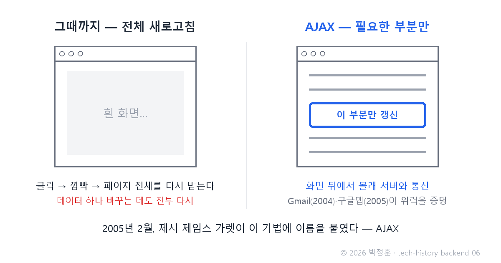
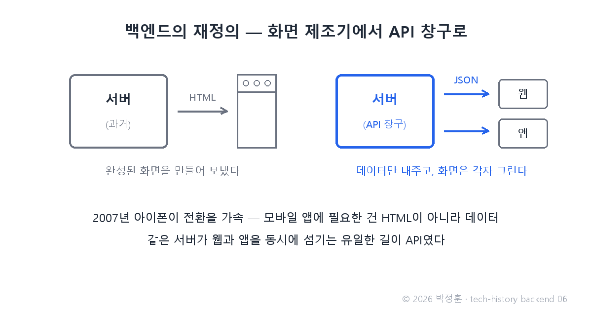

# [발행 6/12] 2005년 AJAX — 구글맵과 Gmail이 새로고침을 없앤 날

- 원본: [02-backend.md](./02-backend.md) Part 3 중 AJAX · 발행: 6번째 · 편성: [plan.md](./plan.md)

| # | 이미지 | 삽입 위치 |
|---|---|---|
| 1 | `images/06-1-reload-vs-ajax.png` | 대표 (첫 첨부) |
| 2 | `images/06-2-server-redefined.png` | 재정의 대목 직후 |

---

## LinkedIn 본문

[테크스토리 백엔드 #06 | 2005년 AJAX — 구글맵과 Gmail이 새로고침을 없앤 날]

2004년 4월 1일, 구글이 무료 1GB 메일 서비스를 발표하자 언론과 대중은 만우절 농담이라고 생각했습니다. 당시 핫메일의 무료 용량은 2MB — 500배 차이였으니까요.

기술의 역사를 "문제 → 해결 → 새로운 문제"의 연쇄로 풀어가는 시리즈, 백엔드 편 6편입니다. (5편: 2000년 REST — API의 문법)
(등장인물과 대화는 이해를 돕기 위한 각색이며, 기술 내용은 모두 실제 기록입니다.)

Gmail 발표 다음 날의 사무실 풍경을 재연하면 이렇습니다.

직장인 A: "구글이 무료 1GB 메일을 낸다는데?"

직장인 B: "어제가 며칠이었는지 봐. 4월 1일. 핫메일이 2MB, 야후가 4MB인데 1GB? 농담이지."

직장인 A: "그게 진짜래. 근데 더 이상한 건, 메일을 열어도 화면이 깜빡이질 않아. 새로고침이 없어."

용량보다 오래 남은 충격은 뒤의 말이었습니다. 당시의 웹은 데이터 하나를 갱신하려 해도 페이지 전체를 새로 받아야 했습니다 — 클릭, 흰 화면, 다시 그리기. 그런데 Gmail과 이듬해의 구글맵은 화면 뒤에서 몰래 서버와 통신하며 필요한 부분만 바꿨습니다. 지도를 끌면 끊김 없이 이어지는 그 경험은 당시로선 마술이었습니다.

2005년 2월, 컨설턴트 제시 제임스 가렛이 이 기법에 이름을 붙입니다 — AJAX. 에세이에서 그가 든 예가 바로 구글맵·구글 서제스트·Gmail이었습니다. 기술 자체는 이전부터 있었지만, 이름과 대표작이 생기자 폭발적으로 확산됐습니다.

백엔드 역사에서 이 순간이 분수령인 이유: 서버의 응답이 "완성된 HTML(화면)"에서 "데이터(JSON)"로 바뀌기 시작했기 때문입니다.

그리고 2007년 아이폰이 이 전환에 기름을 부었습니다. 모바일 앱에는 HTML이 필요 없습니다 — 필요한 건 데이터뿐. 같은 서버가 웹과 앱을 동시에 섬기려면, 화면이 아니라 데이터를 줘야 했습니다.

결과는 백엔드의 재정의입니다. 화면 제조기 → 데이터 공급 창구(API). 화면은 프론트엔드의 책임이 됐고, 서버는 5편의 표준 주문서(REST)로 데이터만 내주는 창구가 됐습니다. 프론트엔드 편에서 본 SPA(단일 페이지 앱)의 독립 — 그 사건의 서버 쪽 반쪽이 바로 이것입니다.

새로운 문제: 서버가 "창구"가 되자, 창구 앞에 줄 서는 손님이 폭증했습니다. 로그인 상태를 어떻게 수많은 서버가 나눠 기억할 것인가, 비밀번호는 어떻게 보관할 것인가 — 보안과 상태 관리의 숙제가 전면에 등장합니다.

다음 편(#07): 링크드인 비밀번호 1억 1,700만 개가 72시간 만에 깨진 이유 — 세션, JWT, 그리고 해싱 이야기로 이어집니다.

(대화는 각색입니다. 출처: Jesse James Garrett "Ajax: A New Approach to Web Applications"(Adaptive Path, 2005.2) / TIME Gmail 10주년 기사 / NPR·PBS의 Gmail 만우절 오인 보도)

© 2026 박정훈 · 전체 시리즈: github.com/nous-zero/tech-history

#기술의역사 #IT역사 #AJAX #Gmail #테크스토리

---

## X 본문 (이미지 06-1 첨부)

2004년 4월 1일 Gmail 발표를 사람들은 만우절 농담으로 여겼다.
무료 1GB — 핫메일(2MB)의 500배.
새로고침 없는 이 기술은 이듬해 AJAX라 명명됐고, 서버는 화면 제조기에서 API 창구가 됐다. (6/12)
