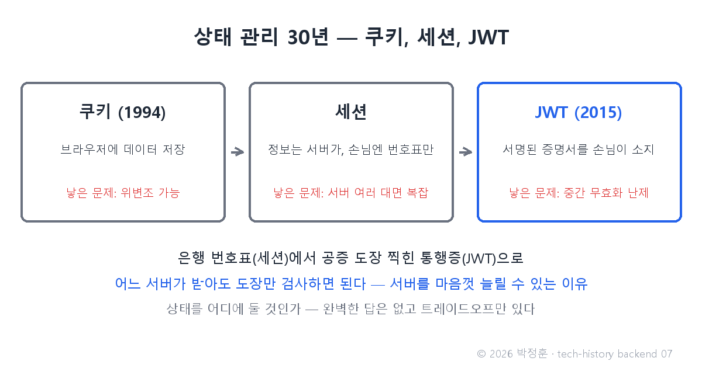
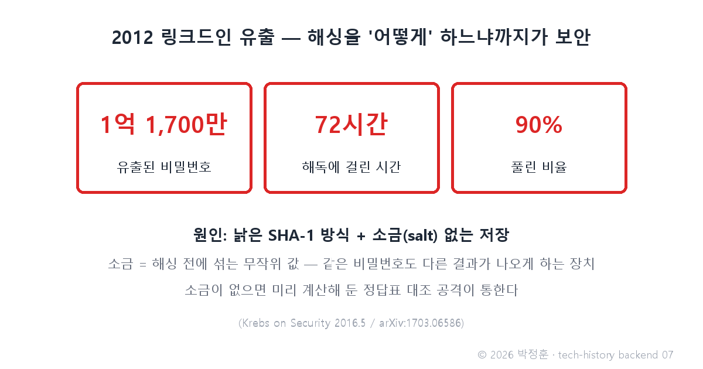

# [발행 7/12] 세션에서 JWT까지 — 링크드인 비밀번호 1억 1,700만 개가 깨진 이유

- 원본: [02-backend.md](./02-backend.md) Part 3 심화 1·2 (상태 관리·인증·해싱) · 발행: 7번째 · 편성: [plan.md](./plan.md)

| # | 이미지 | 삽입 위치 |
|---|---|---|
| 1 | `images/07-1-cookie-session-jwt.png` | 대표 (첫 첨부) |
| 2 | `images/07-2-linkedin-crack.png` | 링크드인 대목 직후 |

---

## LinkedIn 본문

[테크스토리 백엔드 #07 | 세션에서 JWT까지 — 링크드인 비밀번호 1억 1,700만 개가 깨진 이유]

2016년 5월, 링크드인의 2012년 해킹 피해가 알려진 것보다 훨씬 컸다는 사실이 드러납니다. 유출된 비밀번호 1억 1,700만 개 — 그리고 그중 90%가 72시간 만에 풀렸습니다.

기술의 역사를 "문제 → 해결 → 새로운 문제"의 연쇄로 풀어가는 시리즈, 백엔드 편 7편입니다. (6편: 2005년 AJAX — 새로고침을 없앤 날)
(등장인물과 대화는 이해를 돕기 위한 각색이며, 기술 내용은 모두 실제 기록입니다.)

이 사건을 이해하려면, 서버가 손님을 "기억하고 확인하는" 30년의 진화를 따라가야 합니다. 신입과 선배의 대화로 재연합니다.

신입: "로그인 상태 유지요? 2편에서 배운 쿠키에 '나는 admin'이라고 적어두면 되죠."

선배: "브라우저에 둔 데이터는 사용자가 고칠 수 있어. 아무나 자기 쿠키에 'admin'이라고 적으면?"

신입: "아… 그럼 정보는 서버가 갖고 있어야겠네요."

선배: "그게 세션이야. 은행 번호표를 생각해 봐 — 로그인하면 서버가 내 정보를 자기 메모리에 두고, 브라우저엔 번호표(세션 ID)만 줘. 다음 요청 때 번호표를 내밀면 '아, 3번 고객' 하고 알아보는 거지. 그 번호표를 자동으로 내밀어 주는 장치가 쿠키고."

신입: "완벽한데요?"

선배: "서버가 한 대일 때는. 서버가 10대로 늘면, 1번 서버가 준 번호표를 2번 서버는 몰라. 그래서 2015년 표준이 된 JWT는 번호표를 버렸어 — 서버가 기억하는 대신, 사용자가 서명된 증명서를 들고 다니게 한 거야. 공증 도장이 찍힌 통행증이라, 어느 서버든 도장만 검사하면 되고 아무도 기억할 필요가 없지."

주의할 점 하나 — JWT의 내용물은 Base64(어떤 데이터든 알파벳·숫자만으로 적는 표기법)로 적혀 있을 뿐, 누구나 되돌려 읽을 수 있습니다. 서명은 위조를 막는 도장이지 내용을 숨기는 금고가 아닙니다. 그래서 토큰 안에 민감 정보를 넣으면 안 됩니다.

그리고 확인의 문제, 비밀번호. 비밀번호는 원문 그대로 저장하지 않고 해싱을 거칩니다 — 믹서기에 간 과일처럼 원상복구가 불가능하고, 같은 입력이면 항상 같은 결과가 나오는 단방향 변환입니다. 로그인 때는 입력값을 다시 갈아서 결과끼리 비교하죠. DB를 통째로 도둑맞아도 원본 비밀번호는 알 수 없게 하려는 설계입니다.

링크드인은 해싱을 하긴 했습니다. 문제는 "어떻게"였습니다. 낡은 SHA-1 방식에, 소금(salt — 해싱 전에 섞는 무작위 값, 같은 비밀번호도 서로 다른 결과가 나오게 하는 장치) 없이 저장한 겁니다. 소금이 없으면 미리 계산해 둔 정답표와 대조하는 공격이 통합니다. 결과가 1억 1,700만 개 중 90%가 72시간 내 해독 — 해싱을 "하느냐"가 아니라 "어떻게 하느냐"까지가 보안이라는 것을 보여준 사건입니다.

덧붙여 로그인이 전부가 아닙니다. "당신이 누구인가"(인증)와 "당신이 이걸 할 권한이 있는가"(인가)는 다른 문제입니다 — 건물에 들어온 것과 서버실 문을 열 수 있는 건 별개인 것처럼요.

새로운 문제: JWT가 "서버는 아무것도 기억하지 않아도 된다"를 복원한 진짜 이유는 따로 있습니다 — 서버를 마음껏 늘리기 위해서. 그런데 왜 서버를 늘려야 할까요?

다음 편(#08): 1999년, 한 개발자가 서버 업계에 질문을 던집니다 — "서버 한 대가 동시접속 1만 명을 감당할 수 있는가?" C10K와 Node.js 이야기로 이어집니다.

(대화는 각색입니다. 출처: Krebs on Security(2016.5) / arXiv:1703.06586 "The Cryptographic Implications of the LinkedIn Data Breach" / RFC 7519(JWT, 2015.5) / RFC 2109)

© 2026 박정훈 · 전체 시리즈: github.com/nous-zero/tech-history

#기술의역사 #IT역사 #보안 #JWT #테크스토리

---

## X 본문 (이미지 07-2 첨부)

링크드인 2012년 유출 비밀번호 1억 1,700만 개 중 90%가 72시간 만에 풀렸다.
원인은 낡은 SHA-1, 소금(salt) 없는 해싱.
비밀번호는 "어떻게" 저장하느냐까지가 보안이다. (7/12)
