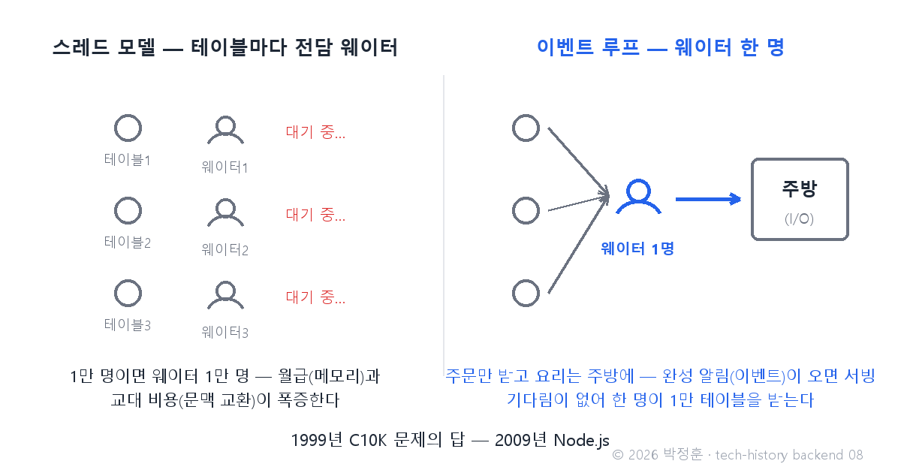
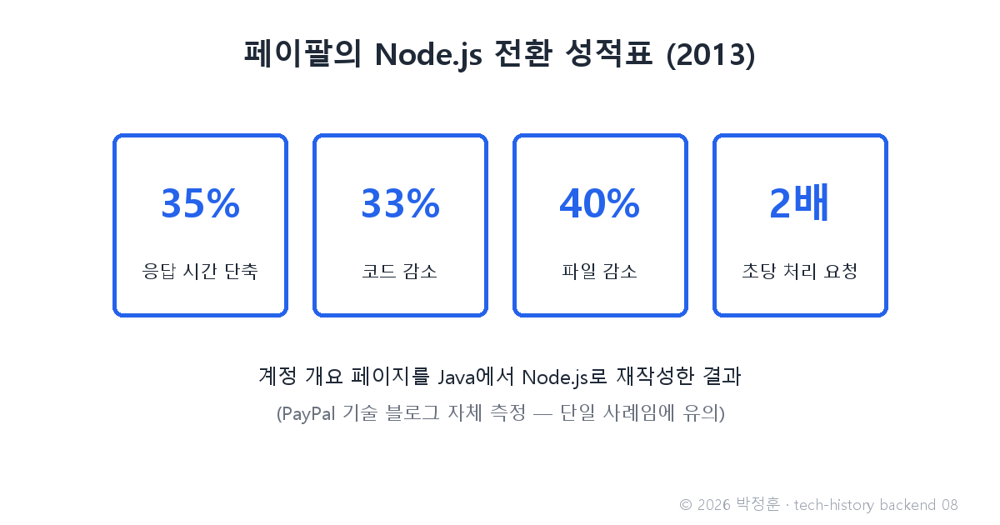

# [발행 8/12] 1999년 C10K 문제 — 동시접속 1만 명과 Node.js의 웨이터 한 명

- 원본: [02-backend.md](./02-backend.md) Part 4 중 C10K·심화 3·Node.js · 발행: 8번째 · 편성: [plan.md](./plan.md)

| # | 이미지 | 삽입 위치 |
|---|---|---|
| 1 | `images/08-1-waiter-model.png` | 대표 (첫 첨부) |
| 2 | `images/08-2-paypal-node.png` | 페이팔 대목 직후 |

---

## LinkedIn 본문

[테크스토리 백엔드 #08 | 1999년 C10K 문제 — 동시접속 1만 명과 Node.js의 웨이터 한 명]

2009년 11월, 베를린의 개발자 콘퍼런스 JSConf EU. 청중 150명 앞에서 무명 개발자의 발표가 끝나자, 이 콘퍼런스 사상 처음으로 기립박수가 터졌습니다.

기술의 역사를 "문제 → 해결 → 새로운 문제"의 연쇄로 풀어가는 시리즈, 백엔드 편 8편입니다. (7편: 세션에서 JWT까지)
(등장인물과 대화는 이해를 돕기 위한 각색이며, 기술 내용은 모두 실제 기록입니다.)

이 박수의 의미를 알려면 10년 전으로 돌아가야 합니다. 1999년, 개발자 댄 케걸이 업계에 질문 하나를 던집니다 — "서버 한 대가 동시접속 1만(Connection 10,000)을 감당할 수 있는가?" 이른바 C10K 문제입니다. 하드웨어는 이미 충분한데, 소프트웨어 구조가 발목을 잡고 있다는 지적이었죠.

당시 서버의 구조를 식당으로 재연하면 이렇습니다.

사장: "손님이 늘면 어떻게 하지?"

매니저: "지금 방식은 손님 한 테이블마다 전담 웨이터(스레드 — 한 프로그램 안에서 일하는 작업 흐름 하나)를 붙이는 겁니다. 손님 1만 명이면 웨이터 1만 명이죠."

사장: "월급은? 자리는?"

매니저: "그게 문제입니다. 웨이터마다 메모리를 차지하고, 누가 일할 차례인지 교대시키는 관리 비용(문맥 교환)이 손님 수보다 빠르게 불어납니다. 게다가 웨이터 대부분은 주방(디스크·DB)이 요리를 마칠 때까지 그냥 서서 기다려요."

2009년 베를린 무대의 주인공, 라이언 달의 답이 Node.js였습니다.

발상은 식당 운영의 역발상입니다 — 유능한 웨이터 한 명이 주문만 받고, 요리는 주방에 맡긴 뒤 바로 다음 테이블로 이동한다. 요리가 끝나면 알림(이벤트)을 받고 그때 서빙한다. 기다림이 사라지니, 웨이터 한 명으로 1만 테이블을 받습니다. 이것이 이벤트 루프 + 논블로킹(하나가 막혀도 나머지는 계속 진행) 방식입니다.

보너스도 있었습니다. Node.js는 자바스크립트로 서버를 짜게 해 줬습니다 — 브라우저 전용이던 언어가 서버로 진출하면서, 한 언어로 앞뒤를 다 짜는 풀스택 개발자 시대가 열렸습니다. 2010년 5월 Express.js가 나와 Node 서버 작성의 표준 틀이 됐고요.

실전 증명은 2013년 페이팔이 했습니다. 계정 개요 페이지를 Java에서 Node.js로 재작성했더니 — 응답 시간 35% 단축, 코드 33% 감소, 파일 40% 감소, 초당 처리 요청 2배(페이팔 기술 블로그 자체 측정 — 단일 사례임에 유의).

새로운 문제: 만능은 아니었습니다. 콜백 지옥(작업 완료 알림 속에 알림이 겹겹이 중첩되는 코드 — 이후 Promise·async/await 문법으로 해결)이 생겼고, 무엇보다 웨이터가 한 명이라 그 웨이터가 직접 오래 걸리는 계산을 하면 홀 전체가 멈춥니다. CPU를 쥐어짜는 작업에는 부적합하다는 뜻입니다.

그리고 웨이터를 아무리 유능하게 만들어도, 손님이 35억 명 몰려오면 얘기가 다릅니다.

다음 편(#09): 2022년 테일러 스위프트 티켓 발매일, 티켓마스터에 벌어진 일 — "서버를 키우지 말고 늘려라"로 이어집니다.

(대화는 각색입니다. 출처: Dan Kegel "The C10K problem"(kegel.com, 1999) / JSConf EU 2009 공식 기록 / PayPal Engineering Blog "Node.js at PayPal"(2013))

© 2026 박정훈 · 전체 시리즈: github.com/nous-zero/tech-history

#기술의역사 #IT역사 #NodeJS #C10K #테크스토리

---

## X 본문 (이미지 08-1 첨부)

1999년의 질문 "서버 한 대가 동시접속 1만을 감당할 수 있는가"(C10K).
2009년 Node.js의 답 — 웨이터 한 명이 주문만 받고 요리는 주방에 맡긴다.
페이팔은 전환 후 응답이 35% 빨라졌다(자체 측정). (8/12)
