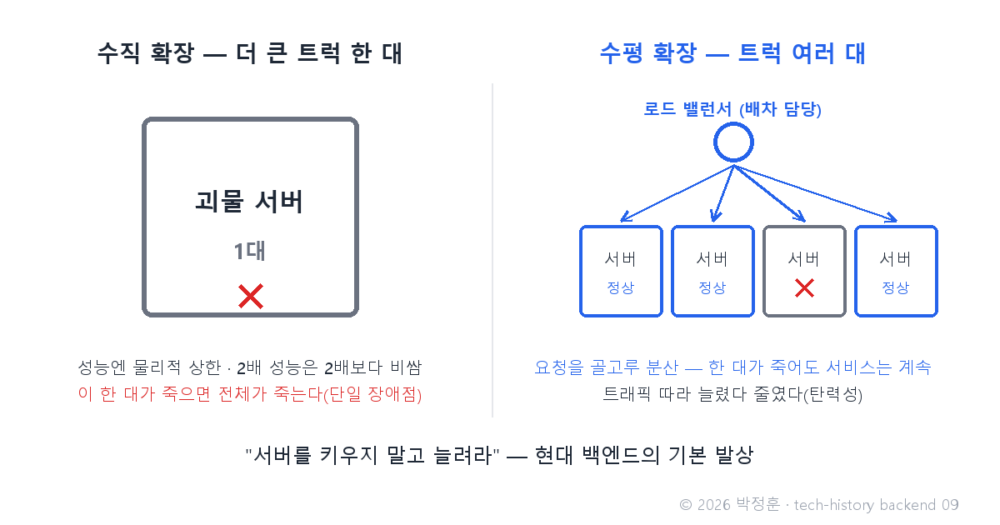
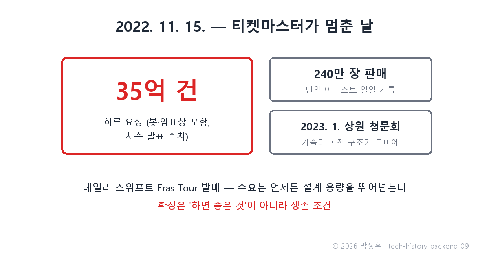

# [발행 9/12] 2022년 티켓마스터 마비 — 35억 요청이 가르쳐준 "서버를 키우지 말고 늘려라"

- 원본: [02-backend.md](./02-backend.md) Part 4 심화 4 (수직/수평 확장) · 발행: 9번째 · 편성: [plan.md](./plan.md)

| # | 이미지 | 삽입 위치 |
|---|---|---|
| 1 | `images/09-1-scale-up-vs-out.png` | 대표 (첫 첨부) |
| 2 | `images/09-2-ticketmaster-35b.png` | 티켓마스터 대목 직후 |

---

## LinkedIn 본문

[테크스토리 백엔드 #09 | 2022년 티켓마스터 마비 — 35억 요청이 가르쳐준 "서버를 키우지 말고 늘려라"]

2022년 11월 15일, 테일러 스위프트의 Eras Tour 티켓 발매일. 티켓마스터에 35억 건의 요청이 몰렸고(봇·암표상 포함, 사측 발표 수치), 사이트는 마비됐습니다. 이 사건은 두 달 뒤 미국 상원 법사위 청문회까지 갔습니다.

기술의 역사를 "문제 → 해결 → 새로운 문제"의 연쇄로 풀어가는 시리즈, 백엔드 편 9편입니다. (8편: C10K와 웨이터 한 명)
(등장인물과 대화는 이해를 돕기 위한 각색이며, 기술 내용은 모두 실제 기록입니다.)

그날 밤 어느 서비스 회사에서든 오갔을 법한 대화를 재연합니다.

신입: "저희도 이런 일 겪으면 어떡해요? 더 좋은 서버로 바꾸면 되나요?"

선배: "그게 수직 확장이야. 트럭이 작으면 더 큰 트럭으로 바꾸는 것. 그런데 세 가지 벽이 있어 — 성능엔 물리적 상한이 있고, 2배 성능은 값이 2배가 아니라 훨씬 비싸고, 바꿔 끼우는 동안 서비스가 멈춰."

신입: "그럼요?"

선배: "트럭을 여러 대로 늘리는 거지. 수평 확장. 같은 서버를 10대, 100대로 늘리고, 앞에 로드 밸런서 — 들어온 요청을 여러 서버에 골고루 나눠 주는 배차 담당자 — 를 세우는 거야."

"키우지 말고 늘려라"가 현대 백엔드의 기본 발상이 된 이유는 세 가지입니다.

하나, 한 대의 성능에는 상한이 있지만 대수에는 사실상 상한이 없습니다. 비용도 대수에 비례해 선형으로 늘어, 괴물 서버 한 대보다 쌉니다.
둘, 한 대는 단일 장애점(그 하나가 죽으면 전체가 죽는 지점)이지만, 여러 대면 한 대가 죽어도 서비스는 계속됩니다.
셋, 트래픽에 따라 늘렸다 줄였다 할 수 있습니다 — 클라우드 시대의 전제인 탄력성입니다.

여기서 7편의 복선이 회수됩니다. 어느 서버가 요청을 받아도 상관없으려면, 서버가 손님을 기억하지 말아야 합니다. 세션(서버 메모리에 기억)이 JWT(사용자가 증명서 소지)로 진화한 진짜 이유가 바로 수평 확장입니다. 상태 관리의 역사와 확장의 역사는 같은 이야기의 양면입니다.

다시 그날의 티켓마스터로. 단일 아티스트 일일 판매 기록인 240만 장을 팔고도 대기열은 무너졌고, 예정됐던 일반 판매는 취소됐습니다. 2023년 1월 상원 청문회는 기술과 독점 구조를 함께 도마에 올렸죠.

이 사건이 백엔드 교과서에 남긴 문장은 하나입니다 — 수요는 언제든 설계 용량을 뛰어넘을 수 있다. 확장은 "하면 좋은 것"이 아니라 생존 조건이라는 것.

새로운 문제: 서버를 100대로 늘리는 순간, 다른 질문이 태어납니다. 그 100대에서 돌아가는 저 거대한 한 덩어리 앱은 어쩔 것인가 — 한 줄 고칠 때마다 전체를 재배포해야 하는데?

다음 편(#10): 넷플릭스는 쪼갰고, 아마존은 다시 합쳐 90%를 아꼈다 — 마이크로서비스 이야기로 이어집니다.

(대화는 각색입니다. 출처: Wikipedia "Taylor Swift–Ticketmaster controversy" / PBS·NPR 보도 / 2023.1 미국 상원 법사위 청문회 기록)

© 2026 박정훈 · 전체 시리즈: github.com/nous-zero/tech-history

#기술의역사 #IT역사 #확장성 #티켓마스터 #테크스토리

---

## X 본문 (이미지 09-2 첨부)

2022년 11월 테일러 스위프트 티켓 발매일, 티켓마스터에 35억 건 요청이 몰려 마비됐다(사측 발표).
남긴 교훈은 "서버를 키우지 말고 늘려라" — 수평 확장이 현대 백엔드의 기본값이 된 이유. (9/12)
