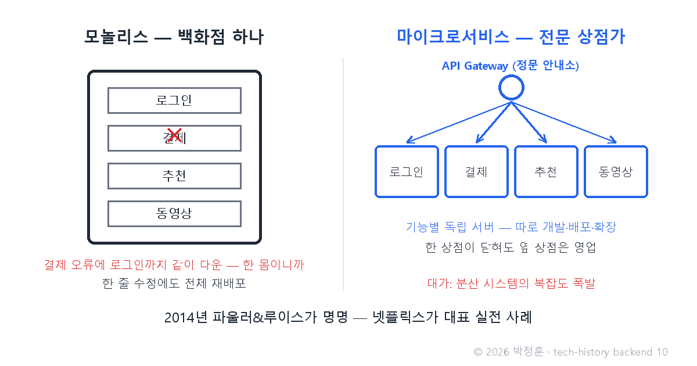
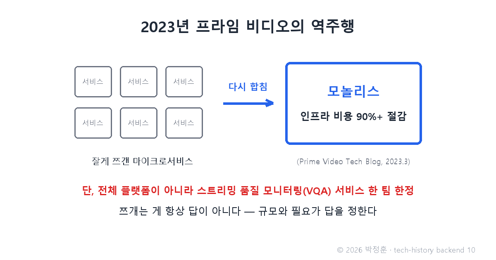

# [발행 10/12] 2014년 마이크로서비스 — 넷플릭스는 쪼갰고, 아마존은 다시 합쳐 90%를 아꼈다

- 원본: [02-backend.md](./02-backend.md) Part 4 중 마이크로서비스 · 발행: 10번째 · 편성: [plan.md](./plan.md)

| # | 이미지 | 삽입 위치 |
|---|---|---|
| 1 | `images/10-1-monolith-vs-micro.png` | 대표 (첫 첨부) |
| 2 | `images/10-2-prime-video.png` | 프라임 비디오 대목 직후 |

---

## LinkedIn 본문

[테크스토리 백엔드 #10 | 2014년 마이크로서비스 — 넷플릭스는 쪼갰고, 아마존은 다시 합쳐 90%를 아꼈다]

2023년 3월, 아마존 프라임 비디오의 한 팀이 기술 블로그에 이단적인 글을 올립니다. 유행대로 잘게 쪼갰던 시스템을 도로 한 덩어리로 합쳤더니, 인프라 비용이 90% 넘게 줄었다는 고백이었습니다.

기술의 역사를 "문제 → 해결 → 새로운 문제"의 연쇄로 풀어가는 시리즈, 백엔드 편 10편입니다. (9편: 티켓마스터 35억 요청)
(등장인물과 대화는 이해를 돕기 위한 각색이며, 기술 내용은 모두 실제 기록입니다.)

이야기는 모놀리스(한 덩어리 앱)의 비명에서 시작합니다. 어느 성장한 서비스 회사의 회의실을 재연하면 이렇습니다.

개발자: "결제 모듈 한 줄 고쳤는데, 왜 전체 서비스를 다 다시 배포해야 하죠?"

운영자: "한 덩어리니까. 더 무서운 건, 아까 결제 쪽 오류 하나에 로그인까지 같이 죽었어. 같은 몸이라 병도 같이 앓아."

개발자: "동영상 기능만 트래픽이 몰리는데, 확장하려면 앱 전체를 복제해야 하고요. 개발자 수백 명이 한 코드베이스에서 매일 충돌하고."

이 문제의식엔 선행 사례가 있습니다. 2002년경 아마존의 이른바 "베조스 API 명령" — 모든 팀은 자기 기능을 반드시 API로만 제공하라는 사내 지침입니다(전 아마존 개발자 스티브 예기의 2011년 회고가 근거로, 1차 사료가 아닌 회고 기반임을 밝혀둡니다). 팀 간의 벽을 API 창구로 강제한 이 지침은 훗날의 구조 전환을 예고했습니다.

2014년 3월, 마틴 파울러와 제임스 루이스가 이 흐름에 이름을 붙입니다 — 마이크로서비스. 거대한 백화점 하나를 전문 상점가로 재개발하듯, 로그인·결제·추천 같은 기능별로 서버를 나눠 독립적으로 개발·배포·확장하는 구조입니다. 넷플릭스가 대표 실전 사례가 됐죠.

상점가에는 부속 시설이 따라옵니다. 손님을 알맞은 상점으로 안내하는 정문 안내소(API Gateway — 모든 요청이 거쳐 가는 관문), 상점끼리 쪽지를 주고받는 우체통(메시지 큐 — 요청을 넣어두면 상대가 나중에 꺼내 처리하는 방식) 같은 것들입니다.

새로운 문제: 쪼개자 복잡도가 폭발했습니다. 서비스 간 통신, 한 상점의 장애가 옆 상점으로 번지는 문제, 그리고 "수십 개 서비스를 대체 어떻게 배포·관리하나". 이 마지막 질문의 답(Docker, Kubernetes, CI/CD)은 시리즈 05 배포편의 주인공입니다.

그리고 2023년의 그 고백. 아마존 프라임 비디오에서 스트리밍 품질을 감시하는 모니터링(VQA) 서비스 팀이, 잘게 쪼갠 구조를 다시 모놀리스로 합쳐 비용을 90% 이상 절감했습니다. 분명히 해 둘 것은 범위입니다 — 프라임 비디오 전체 플랫폼이 아니라, 모니터링 서비스 한 팀의 이야기입니다. 그럼에도 "유행 따라 쪼개는 것"에 경종을 울리기엔 충분했습니다.

교훈: 쪼개는 게 항상 답이 아닙니다. 규모와 필요가 답을 정합니다. 넷플릭스급 규모와 조직에는 상점가가 맞고, 한 팀의 파이프라인에는 백화점이 맞을 수 있습니다.

다음 편(#11): 서비스가 수십 개가 되자 서버 관리 부담이 역으로 폭증했다 — 그래서 아예 "서버 관리"라는 일을 없애 버린 AWS Lambda, 그리고 GraphQL 이야기로 이어집니다.

(대화는 각색입니다. 출처: Fowler & Lewis "Microservices"(martinfowler.com, 2014.3.25) / Steve Yegge "Google Platforms Rant"(2011) / Prime Video Tech Blog(2023.3))

© 2026 박정훈 · 전체 시리즈: github.com/nous-zero/tech-history

#기술의역사 #IT역사 #마이크로서비스 #아키텍처 #테크스토리

---

## X 본문 (이미지 10-2 첨부)

넷플릭스는 서버를 잘게 쪼개 성공했고, 아마존 프라임 비디오의 한 팀은 2023년 도로 합쳐 비용 90%를 아꼈다(모니터링 서비스 한정).
쪼개기가 답이 아니라, 규모와 필요가 답을 정한다. (10/12)
