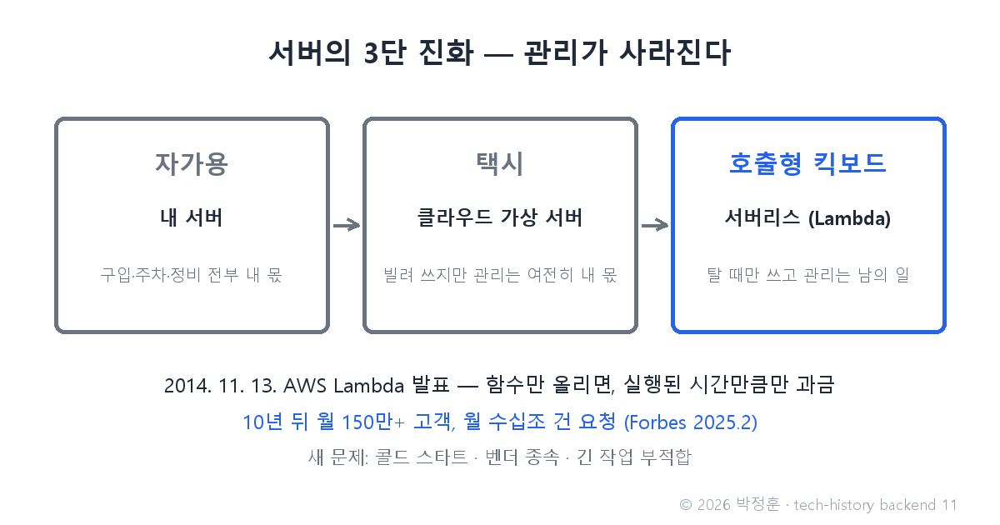
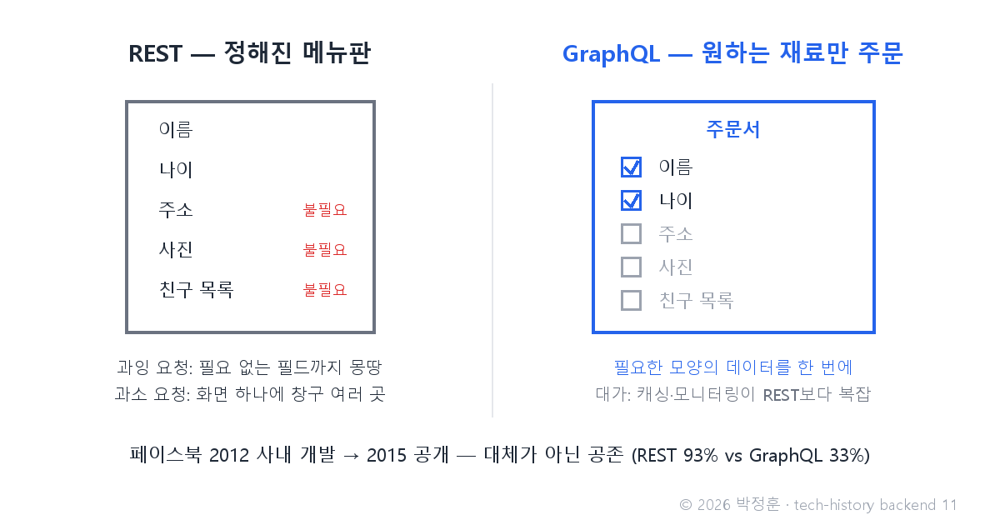

# [발행 11/12] 2014년 AWS Lambda — 서버 관리라는 일이 사라지기 시작했다, 그리고 GraphQL

- 원본: [02-backend.md](./02-backend.md) Part 4 중 서버리스 + Part 3 중 GraphQL · 발행: 11번째 · 편성: [plan.md](./plan.md)

| # | 이미지 | 삽입 위치 |
|---|---|---|
| 1 | `images/11-1-serverless-ladder.png` | 대표 (첫 첨부) |
| 2 | `images/11-2-graphql-order.png` | GraphQL 대목 직후 |

---

## LinkedIn 본문

[테크스토리 백엔드 #11 | 2014년 AWS Lambda — 서버 관리라는 일이 사라지기 시작했다, 그리고 GraphQL]

2014년 11월 13일, AWS 연례 콘퍼런스 re:Invent. 아마존이 발표한 신제품의 약속은 파격이었습니다 — "함수 코드만 올리세요. 서버는 저희가 알아서 합니다. 요금은 실행된 시간만큼만."

기술의 역사를 "문제 → 해결 → 새로운 문제"의 연쇄로 풀어가는 시리즈, 백엔드 편 11편입니다. (10편: 마이크로서비스 — 쪼개고 다시 합치다)
(등장인물과 대화는 이해를 돕기 위한 각색이며, 기술 내용은 모두 실제 기록입니다.)

지난 편의 상점가(마이크로서비스)에는 청구서가 따라왔습니다. 어느 운영팀의 대화를 재연하면 이렇습니다.

운영자: "서비스를 30개로 쪼갰더니, 이제 서버 30벌을 각각 준비하고, 확장하고, 보안 패치해야 해. 관리 부담이 30배가 됐어."

개발자: "쪼갠 건 개발을 편하게 하려던 건데, 운영이 지옥이 됐네요."

운영자: "그래서 아마존의 답이 이거야 — 서버 관리라는 일 자체를 없애 버리자."

AWS Lambda의 방식은 이렇습니다. 개발자는 함수(특정 요청을 처리하는 코드 조각) 하나만 올려 둡니다. 요청이 오면 그때만 실행되고, 실행된 시간만큼만 과금됩니다. 이런 방식을 FaaS(Function as a Service), 통칭 서버리스라 부릅니다.

이동 수단에 비유하면 3단 진화입니다. 자가용(내 서버 — 구입·주차·정비 전부 내 몫) → 택시(클라우드 가상 서버 — 빌려 쓰지만 여전히 관리는 함) → 호출형 킥보드(서버리스 — 탈 때만 쓰고 관리는 아예 남의 일).

이름에 관한 오해 하나 — "서버리스"에도 서버는 있습니다. 사라진 건 서버가 아니라 "서버를 관리하는 일"입니다. 출시 10년이 된 시점의 규모가 그 수요를 증명합니다. 월 150만 이상의 고객, 월 수십조 건의 요청 처리(Forbes, 2025.2).

새로운 문제: 콜드 스타트(한동안 안 쓰인 함수의 첫 호출이 느려지는 현상 — 시동이 꺼져 있던 킥보드를 깨우는 시간), 특정 클라우드에 묶이는 벤더 종속, 그리고 긴 작업엔 부적합하다는 한계가 생겼습니다.

같은 시기, API 창구 쪽에서도 개선이 있었습니다. 모바일 시대가 되자 5편의 REST에서 두 가지 비효율이 드러났거든요 — 과잉 요청(필요 없는 필드까지 몽땅 받음)과 과소 요청(화면 하나 그리는 데 창구 여러 곳을 돌아야 함).

페이스북이 2012년 사내에서 만들어 2015년 오픈소스로 공개한 GraphQL은, 정해진 메뉴판 대신 손님이 주문서에 원하는 재료를 직접 적게 했습니다 — "이 필드와 이 필드만 주세요." 한 번의 요청으로 딱 필요한 모양의 데이터를 받습니다.

다만 GraphQL도 공짜가 아닙니다 — 캐싱(자주 쓰는 응답을 미리 담아 두는 임시 저장)과 모니터링이 REST보다 복잡해, REST를 대체하기보다 공존 중입니다(Postman 2025 기준 사용률: REST 93%, GraphQL 33%).

다음 편(#12, 완결): 그래서 결국 뭘 배워야 하나 — Java·Go·Node·Python의 지형도와, AI 시대의 합류 지점 FastAPI로 시리즈를 마칩니다.

(대화는 각색입니다. 출처: AWS re:Invent 2014 Lambda 발표 / Forbes "A Decade Of AWS Lambda"(2025.2) / graphql.org / Facebook Engineering 블로그(2015.9) / Postman State of the API 2025)

© 2026 박정훈 · 전체 시리즈: github.com/nous-zero/tech-history

#기술의역사 #IT역사 #서버리스 #AWSLambda #테크스토리

---

## X 본문 (이미지 11-1 첨부)

2014년 AWS Lambda 발표 — 함수만 올리면 서버 관리는 남의 일이 됐다.
10년 뒤 월 150만+ 고객, 월 수십조 건 요청(Forbes).
"서버리스"에도 서버는 있다. 사라진 건 관리라는 일이다. (11/12)
