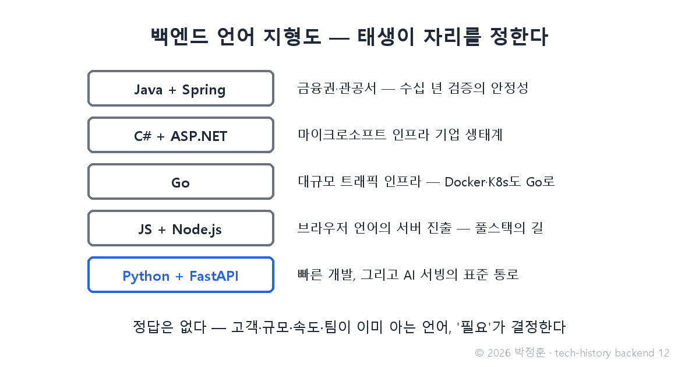
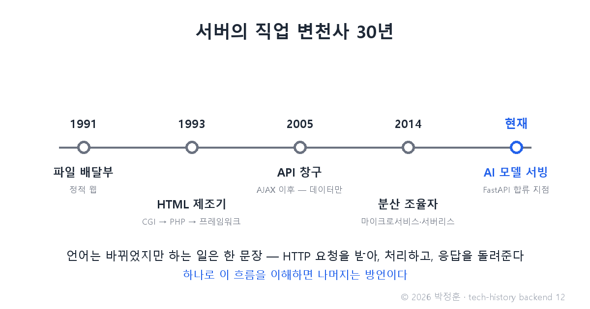

# [발행 12/12] 2018년 FastAPI와 언어 전쟁 — Java·Go·Node·Python 중 뭘 배워야 하나 (완결)

- 원본: [02-backend.md](./02-backend.md) Part 5·6 (언어 생태계·결론) · 발행: 12번째 · 편성: [plan.md](./plan.md)

| # | 이미지 | 삽입 위치 |
|---|---|---|
| 1 | `images/12-1-language-map.png` | 대표 (첫 첨부) |
| 2 | `images/12-2-server-30years.png` | 30년 요약 대목 직후 |

---

## LinkedIn 본문

[테크스토리 백엔드 #12·완결 | 2018년 FastAPI와 언어 전쟁 — Java·Go·Node·Python 중 뭘 배워야 하나]

"백엔드를 시작하려는데, Java·Go·Node·Python 중 뭘 배워야 하나요?" — 이 질문에 30년의 역사가 준비해 둔 답이 있습니다.

기술의 역사를 "문제 → 해결 → 새로운 문제"의 연쇄로 풀어가는 시리즈, 백엔드 편 마지막 12편입니다. (11편: AWS Lambda — 서버 관리가 사라지다)
(등장인물과 대화는 이해를 돕기 위한 각색이며, 기술 내용은 모두 실제 기록입니다.)

취업을 준비하는 후배와 멘토의 대화로 재연합니다.

후배: "언어가 너무 많아요. 뭐가 제일 좋은 언어예요?"

멘토: "질문이 틀렸어. '제일 좋은 언어'가 아니라 '누가 어떤 필요로 만들었나'를 봐야 해. 지형도를 그려 줄게."

Java + Spring — 2000년대 초부터 금융권·관공서 같은 엔터프라이즈(대기업·기관) 시장의 표준. 수십 년 검증에서 오는 안정성과 신뢰가 무기.
C# + ASP.NET — 마이크로소프트 생태계의 답. 윈도우/MS 인프라 기업에 최적.
Go — 구글이 만든 언어. 복잡한 문법 없이 동시 요청 수천 건을 처리하는 성능. Docker·Kubernetes 같은 서버 인프라 자체가 Go로 쓰였다.
JavaScript + Node.js — 원래 브라우저 전용이던 언어의 서버 진출(8편). 한 언어로 앞뒤를 다 짜는 풀스택의 길.
Python + Django/FastAPI — 읽기 쉬운 문법과 빠른 개발. 그리고 AI의 언어.

이 지형도의 막내가 FastAPI입니다. Python은 AI의 언어가 됐는데, 기존 Python 웹 프레임워크는 API 전용으로 쓰기엔 무겁거나 느렸고 문서화도 수작업이었습니다. 2018년 12월, 세바스티안 라미레스가 공개한 FastAPI는 비동기 기반의 속도에 API 문서 자동 생성까지 얹었고 — Stack Overflow 2025 설문에서 사용률 15.1%로 Python 웹 프레임워크 중 처음으로 Flask를 추월했습니다. 학습된 AI 모델을 세상에 서비스하는 표준 통로가 된 겁니다.

후배: "그래서… 답이 뭔데요?"

멘토: "정답은 없고, 필요가 결정해. 고객이 금융권이면 Java가 이미 표준이고, 초당 수만 요청이면 Go 같은 선택지가 있고, 혼자 빨리 만들어야 하면 Rails·Django·FastAPI야. 그리고 팀이 이미 아는 언어가 사실 제일 힘이 세지."

후배: "그럼 하나를 골라 배우면, 나머지는 버리는 건가요?"

멘토: "여기가 30년 역사의 결론이야. 이름과 문법이 달라도 백엔드가 하는 일은 딱 한 문장이거든 — HTTP 요청을 받아, 처리하고, 응답을 돌려준다. 30년간 언어는 바뀌었지만 이 문장은 바뀐 적이 없어. 하나로 이 흐름을 이해하면 나머지는 방언이야."

이 시리즈가 걸어온 30년을 서버의 직업 변천사로 요약하면 — 파일 배달부(1991) → HTML 제조기(1993, CGI부터) → API 창구(2005, AJAX 이후) → 분산 시스템의 조율자(2014, 마이크로서비스·서버리스) → 그리고 지금, AI 모델 서빙 플랫폼.

프론트엔드 편의 결말은 "프론트엔드는 백엔드의 API를 호출해 화면을 그린다"였고, 백엔드 편의 결말은 "백엔드는 화면을 버리고 API 창구가 되었다"입니다. 두 시리즈는 같은 사건을 반대편 참호에서 본 기록입니다 — 한쪽만 읽으면 반쪽 역사입니다.

백엔드 편은 여기서 완결입니다. 그런데 창구가 내주는 그 데이터는 대체 어디에 어떻게 저장돼 있을까요? 다음 시리즈(03 데이터베이스)에서 이어집니다.

(대화는 각색입니다. 출처: fastapi.tiangolo.com / Stack Overflow Developer Survey 2025 / spring.io / go.dev / 02-backend.md 참고 자료 전체)

© 2026 박정훈 · 전체 시리즈: github.com/nous-zero/tech-history

#기술의역사 #IT역사 #FastAPI #백엔드 #테크스토리

---

## X 본문 (이미지 12-2 첨부)

백엔드 언어는 달라도 하는 일은 30년째 한 문장이다 —
HTTP 요청을 받아, 처리하고, 응답을 돌려준다.
하나를 이해하면 나머지는 방언. 백엔드 편 완결. (12/12)
