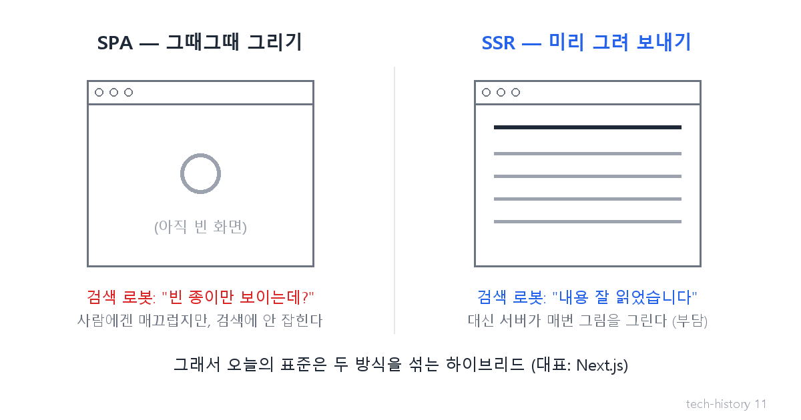
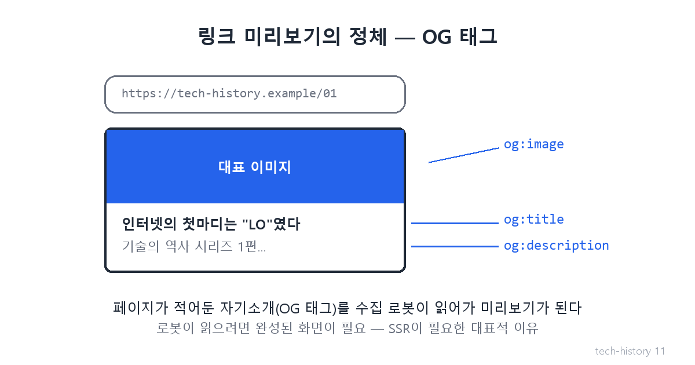

# [발행 11/11·완결] 앱이 된 웹 — SPA·SSR, 그리고 직군의 재정의

- 원본: [01-frontend.md](../01-frontend.md) Part 3 전환④ + Part 4 · 발행: 11번째 (D+30) · 편성: [plan.md](./plan.md)

| # | 이미지 | 삽입 위치 |
|---|---|---|
| 1 | `images/11-1-csr-vs-ssr.png` | 대표 (첫 첨부) |
| 2 | `images/11-2-og-preview.png` | 미리보기 대목 직후 |

---

## LinkedIn 본문

[테크스토리 #11·완결 | 앱이 된 웹]

카톡에 링크를 붙일 때 뜨는 미리보기 한 장 — 거기에 웹 30년의 마지막 전쟁이 담겨 있습니다.

기술의 역사를 "문제 → 해결 → 새로운 문제"의 연쇄로 풀어가는 시리즈, 마지막 11편입니다. (10편: 알아서 바뀌는 화면)
(등장인물과 대화는 이해를 돕기 위한 각색이며, 기술 내용은 모두 실제 기록입니다.)

2010년대, 사용자의 눈높이가 변했습니다.

사용자: "앱은 부드럽게 넘어가는데, 웹은 왜 누를 때마다 화면이 하얗게 깜빡여?"

이유가 있습니다. 전통 웹은 페이지를 이동할 때마다 서버에서 새 화면을 통째로 받아 전부 다시 그렸거든요. 이사 갈 때마다 집을 새로 짓는 셈입니다.

해결(SPA): 첫 방문 때 필요한 걸 한 번에 받아오고, 이후엔 바뀌는 부분만 자바스크립트가 갈아 끼웁니다. 깜빡임이 사라지고, 웹이 앱처럼 매끄러워졌습니다.

새로운 문제: 얻으면 잃습니다. 검색 로봇(구글 등이 보내는 수집기)이 처음 페이지를 열면, 아직 내용이 채워지기 전의 빈 종이만 보게 된 겁니다. 검색에 안 잡히는 웹 — 장사하는 입장에선 치명타입니다. 첫 로딩도 무거워졌습니다.

해결의 해결(SSR): 그럼 서버가 완성된 화면을 미리 그려서 보내주자. 검색 로봇도 내용을 읽고 첫 화면도 빨라집니다.
그 대가: 서버가 매번 그림을 그리니 서버 부담이 커집니다.
절충: 페이지 성격에 따라 두 방식을 섞는 하이브리드(대표 도구 Next.js)가 오늘의 표준이 됐습니다.

이제 처음의 미리보기 이야기로 돌아갑니다. 카톡·슬랙에 링크를 붙일 때 뜨는 제목·이미지 — 페이지가 자기소개를 표준 형식(오픈그래프, OG 태그)으로 적어두면 수집 로봇이 읽어가는 방식입니다. 로봇이 읽으려면 빈 종이가 아니라 완성된 화면이어야 하니, 서버가 미리 그려주는 SSR이 필요한 대표적 이유가 됐죠. 여러분이 매일 보는 그 미리보기 한 장이, 30년 기술 전쟁의 산물입니다.

그리고 30년의 결말, 직군의 재정의. 이 여정을 지나며 '웹 화면 만드는 일'은 디자인 보조가 아니라 설계·상태 관리·성능·데이터 통신을 다루는 독립 엔지니어링 영역, 프론트엔드 개발이 됐습니다.

시리즈를 관통한 법칙을 마지막으로 한 번 더:

모든 해결은 새로운 문제를 낳는다. 그리고 그 문제가 다음 혁신의 입구다.

핵 공포 → 그물망 인터넷 → 공통 언어 → 웹 → 그림 → 반응하는 웹 → 끼워팔기 전쟁 → 속도 전쟁 → 탈옥 → 레고 조립 → 자동 화면 → 앱이 된 웹. 다음 문제는 언제나, 이미 자라고 있습니다.

11편까지 함께해 주셔서 감사합니다. 다음 시리즈는 화면 뒤편 — 백엔드의 역사입니다. 어떤 기술의 역사가 궁금하신지 댓글로 남겨주세요.

(대화는 각색입니다. 출처: Next.js 공식 문서 / Google Search Central "JavaScript SEO basics" / Open Graph 프로토콜(ogp.me))

#기술의역사 #IT역사 #프론트엔드 #SSR #테크스토리

---

## X 본문 (이미지 11-2 첨부)

웹이 앱처럼 매끄러워진 대가는 '검색 로봇에겐 빈 종이'였다.
그래서 서버가 미리 그려주는 SSR이 왔고, 카톡 링크 미리보기가 그 산물이다.
30년의 법칙: 모든 해결은 새 문제를 낳는다. (11/11·완결)
