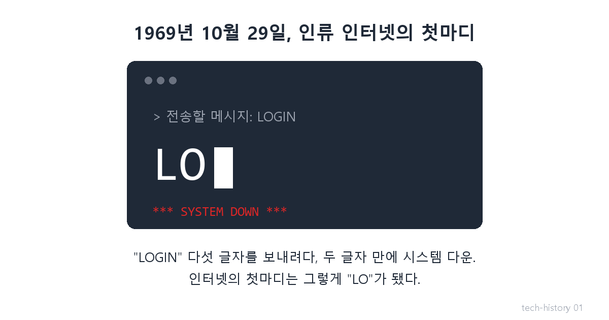
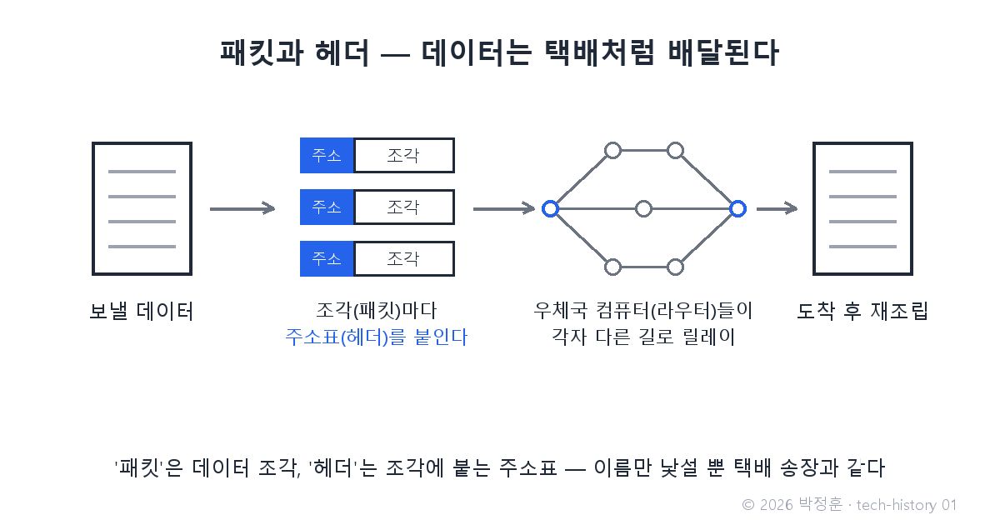
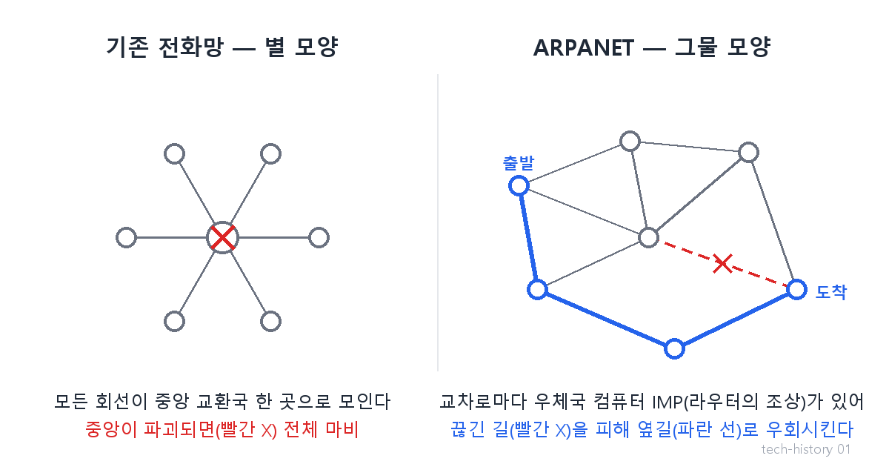

# [발행 1/11] 인터넷의 첫마디는 "LO"였다 — ARPANET

- 원본: [01-frontend.md](./01-frontend.md) Part 1 중 ARPANET
- 발행 채널: LinkedIn(본문+이미지 3장) + X(축약본+이미지 1장)
- 발행 순서: 1번째 (D+0) · 전체 편성: [plan.md](./plan.md)
- 적용 원칙: 대화체 각색 · 비유 실명 태그 · 용어 이미지 · 현대 사례 1개 · [visual-style-guide.md](../visual-style-guide.md)

## 첨부 이미지 (PNG 1200x630 — 변환 없이 바로 업로드)

| # | 파일 | 삽입 위치 |
|---|---|---|
| 1 | `images/01-1-first-message-lo.png` | 대표 이미지 (첫 번째 첨부 — 피드에서 먼저 보임) |
| 2 | `images/01-3-packet-header.png` | 연구원이 패킷을 설명한 직후 (용어 이해) |
| 3 | `images/01-2-star-vs-mesh.png` | 회의실 대화가 끝난 직후 (구조 이해) |

> 이미지 수정·추가는 [images/generate_images.py](./images/generate_images.py) 실행으로 재생성 (시리즈 전체 톤앤매너가 코드로 고정됨).

---

## LinkedIn 본문

[테크스토리 #01 | ARPANET — 핵전쟁 공포가 낳은 인터넷, 첫마디는 "LO"]

인터넷이 인류에게 건넨 첫마디는 "LO"였습니다.

안녕하세요, 기술의 역사를 "문제 → 해결 → 새로운 문제"의 연쇄로 공부하며 이야기로 기록하는 박정훈입니다. 웹과 AI가 어떻게 지금의 모습이 됐는지, 그 시작부터 차례로 풀어갑니다. 1편은 모든 것의 출발점 — 인터넷의 탄생입니다.

그 어설픈 첫마디가 나오기까지, 아마 이런 대화가 있었을 겁니다.
(등장인물과 대화는 이해를 돕기 위한 각색이며, 기술 내용은 모두 실제 기록입니다.)

1969년, 미 국방부의 어느 회의실.

장군: "소련 미사일이 우리 전화 교환국 한 곳을 때리면, 통신은 어떻게 되나?"

참모: "…전부 끊깁니다. 모든 회선이 중앙 한 곳으로 모이는 별 모양 구조라서요."

장군: "심장이 하나라, 심장만 노리면 죽는다는 거군. 심장이 없는 통신망은 못 만드나?"

연구원: "선부터 다르게 깔면 됩니다. 컴퓨터끼리 서로서로 잇는 그물 모양으로요. 그리고 데이터를 잘게 쪼개서 조각마다 받는 주소를 적습니다. 이 조각의 이름이 '패킷'입니다. 교차로마다 우체국 역할을 할 전용 컴퓨터를 세우면, 우체국이 주소를 보고 조각을 이웃에게 릴레이로 넘깁니다. 이웃이 죽으면? 지도에서 지우고 산 이웃 쪽으로 보냅니다."

장군: "잠깐. 선은 다 유선인데 무슨 수로 '다른 길'로 가나?"

연구원: "그물이니까요. 별 모양엔 길이 하나뿐이지만, 그물엔 어디로 가든 길이 여러 갈래입니다. 옆길은 비유가 아니라, 돈 들여 미리 깔아두는 진짜 회선입니다."

장군: "그래도 어느 기지 주변 회선이 몽땅 끊기면, 거긴 고립 아닌가?"

연구원: "맞습니다. 우리가 만드는 건 '절대 안 끊기는 망'이 아닙니다. 적이 끊으려면 한 발이 아니라 수십 발을 동시에 맞혀야 하는 망입니다. 완벽한 방패가 아니라, 뚫는 값을 감당 못 하게 올리는 겁니다."

장군: "…심장을 없애는 게 아니라, 심장을 수백 개로 쪼개자는 거군. 해보게."

그해 10월 29일 밤, UCLA 연구실.
그렇게 만든 그물망 ARPANET의 첫 시험. 스탠퍼드 연구소로 보낼 첫 메시지는 "LOGIN" 다섯 글자였습니다.

L… O… 그리고 시스템 다운.

인류 인터넷의 첫마디는 그렇게 "LO"가 됐습니다. "Hello"를 말하려다 숨이 넘어간 셈이죠. (한 시간 뒤 재시도에서 다섯 글자가 다 전송됐습니다.)

참, 대화 속 '우체국 컴퓨터'는 비유가 아니라 실물입니다. 이름은 IMP — 냉장고만 한 이 전용 컴퓨터가 각 거점에 실제로 설치됐고, 그 후손이 지금 여러분 집 공유기 속 '라우터'입니다. 조각마다 붙는 주소도 실물입니다 — 택배 송장에 해당하는 데이터로, 이름은 '헤더'입니다.

그리고 그 연구원의 마지막 경고는 55년이 지난 지금도 유효합니다.

2022년, 남태평양의 통가는 화산 폭발로 해저 케이블 단 한 가닥이 끊기자 나라 전체가 5주간 인터넷에서 고립됐습니다. 그물의 가장자리에 한 가닥으로 매달린 곳은, 1969년이든 지금이든 섬이 됩니다.

모든 해결은 새로운 문제를 낳는다. 그리고 그 문제가 다음 혁신의 입구다.

ARPANET도 그랬습니다. 컴퓨터들이 연결되자마자 새로운 문제가 드러났거든요 — 기관마다 네트워크 방식이 달라, 서로 '말'이 안 통했던 겁니다.

다음 편(#02): 흩어진 네트워크들에게 공통 언어를 가르치고, 1983년 1월 1일 단 하루에 인터넷 전체가 언어를 갈아탄 이야기 — TCP/IP. 3일에 한 편씩 이어집니다.

(대화는 각색입니다. 출처: Internet Society "Brief History of the Internet" / Paul Baran "On Distributed Communications", RAND 1964 / 통가: Al Jazeera·NPR 2022.2.22 보도)

#기술의역사 #IT역사 #인터넷 #ARPANET #테크스토리

---

## X 본문 (한글 약 140자 제한 — 아래는 130자 내외 · 이미지 01-1 첨부)

인터넷의 첫마디는 "LO"였다.
1969년 "LOGIN" 5글자를 보내다 L, O에서 시스템 다운.
핵전쟁 공포가 그물망 인터넷을 낳았지만, 2022년 통가는 케이블 한 가닥이 끊겨 5주간 고립됐다.
모든 해결은 새 문제를 낳는다 — 그게 혁신의 입구다. (1/11)
