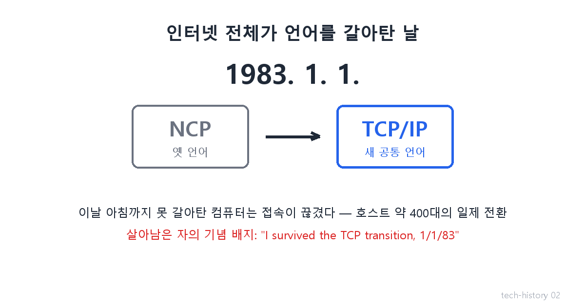
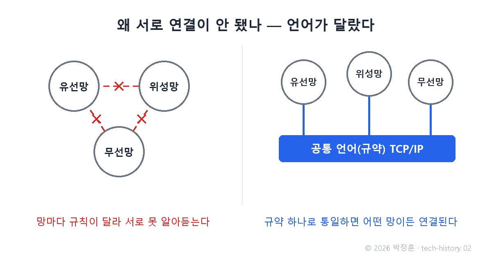
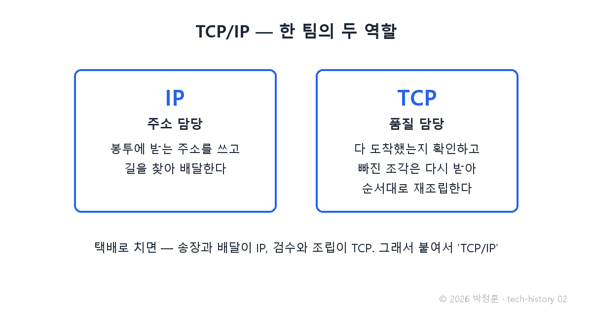

# [발행 2/11] 하루 만에 언어를 갈아탄 날 — TCP/IP

- 원본: [01-frontend.md](../../01-frontend.md) Part 1 중 TCP/IP
- 발행 채널: LinkedIn(본문+이미지 3장) + X(축약본+이미지 1장)
- 발행 순서: 2번째 (D+3) · 전체 편성: [plan.md](./plan.md)
- 적용 원칙: 대화체 각색 · 비유 실명 태그 · 용어 이미지 · 현대 사례 1개 · [visual-style-guide.md](../visual-style-guide.md)

## 첨부 이미지 (PNG 1200x630 — 변환 없이 바로 업로드)

| # | 파일 | 삽입 위치 |
|---|---|---|
| 1 | `images/02-1-flag-day.png` | 대표 이미지 (첫 번째 첨부) |
| 2 | `images/02-2-common-language.png` | 장면 1(연구실 대화) 직후 |
| 3 | `images/02-3-tcp-ip-roles.png` | IP/TCP 역할 설명 직후 |

---

## LinkedIn 본문

[테크스토리 #02 | TCP/IP — 1983년 1월 1일, 인터넷 전체가 하루 만에 언어를 갈아탄 날]

1982년 12월 31일 밤, 세계 곳곳의 전산실에는 퇴근하지 못한 사람들이 있었습니다.

다음 날 아침, 인터넷 전체가 언어를 갈아타기로 되어 있었기 때문입니다.

기술의 역사를 "문제 → 해결 → 새로운 문제"의 연쇄로 이야기로 풀어가는 시리즈, 2편입니다. (1편: 인터넷의 첫마디는 "LO"였다)

이야기는 10년 전으로 거슬러 갑니다.
(등장인물과 대화는 이해를 돕기 위한 각색이며, 기술 내용은 모두 실제 기록입니다.)

1970년대 중반, 어느 연구실.

후배: "지난 편의 그물망(ARPANET)은 잘 돌아가잖아요. 뭐가 문제죠?"

선배: "그 사이 망이 늘었어. 배·비행기용 위성망, 차량용 무선망. 그런데 셋이 서로 말이 안 통해."

후배: "말이 안 통한다니요? 셋 다 데이터를 주고받는 기계잖아요."

선배: "망마다 데이터를 싸는 방식, 주소 쓰는 방식, 확인하는 방식 — 규칙이 전부 달라. 사람으로 치면 한쪽은 한국어, 한쪽은 아랍어, 한쪽은 수화야."

후배: "그럼 세 망을 다 뜯어고쳐서 하나로 만들면…"

선배: "안 돼. 각자 사정이 있어서 그렇게 만든 거야. 위성은 느리지만 바다를 건너고, 무선은 끊기지만 움직이면서 쓰지. 망을 고치는 게 아니라 — 망 위에 공통 봉투를 씌우는 거야. 어떤 망을 지나든, 봉투 규격만 같으면 통하게."

후배: "그 봉투 규격의 이름이…"

선배: "'규약'이야. 영어로 프로토콜. 1974년에 빈트 서프와 로버트 칸이 그 설계도를 논문으로 냈어. 이름은 TCP/IP."

이름이 어렵지, 역할은 택배 회사와 같습니다. IP는 주소 담당 — 봉투에 받는 주소를 쓰고 길을 찾아 배달합니다. TCP는 품질 담당 — 조각이 다 도착했는지 확인하고, 빠진 건 다시 받아, 순서대로 재조립합니다. 둘이 한 팀이라 붙여서 TCP/IP라 부릅니다.

문제는 전환이었습니다. 이미 옛 언어(이름은 NCP)로 잘 돌아가는 컴퓨터들을 어떻게 새 언어로 갈아태울 것인가. 미루면 영원히 못 합니다. 그래서 초강수가 나왔습니다.

1982년 12월 31일 밤, 어느 전산실.

운영자: "공지 다시 읽어볼게요. '1983년 1월 1일부로 옛 언어는 차단된다. 새 언어로 갈아타지 못한 컴퓨터는 인터넷에서 잘린다.' …전부요? 유예 없이?"

관리자: "전부. 유예 없이. 그래서 오늘 밤 아무도 퇴근을 못 하는 거야."

1983년 1월 1일. 약 400대의 호스트 컴퓨터가 일제히 언어를 갈아탔습니다. 훗날 'Flag Day'라 불리는 날입니다. 밤을 새운 사람들에게는 흰 바탕에 붉은 글씨의 기념 배지가 돌았습니다 — "I survived the TCP transition, 1/1/83" (나는 TCP 전환에서 살아남았다). 전환을 이끈 댄 린치가 사비로 500개를 만든, 실제로 존재하는 배지입니다.

이 공통 언어는 43년이 지난 지금도 인터넷의 근간입니다. 이 글이 여러분에게 도착한 것도 TCP/IP 덕분입니다.

그런데 반전이 하나 있습니다. 인터넷은 지금 딱 한 번 더, 언어의 일부를 갈아타는 중입니다. 주소가 바닥났거든요(옛 주소 체계 IPv4 → 새 주소 체계 IPv6). 1983년엔 컴퓨터가 400대라 하루면 됐습니다. 지금은 수십억 대 — 구글 측정 기준 2026년 3월에야 처음으로 절반(50.1%)을 넘었습니다. 전환을 시작한 지 20년이 넘었는데도요.

해결이 완벽할수록 그 위에 쌓이는 것이 많아지고, 다음 교체는 그만큼 어려워집니다. 성공한 표준은 축복이자 족쇄입니다.

다음 편(#03): 도로(인터넷)와 공통 언어(TCP/IP)까지 완성됐는데, 정작 그 위에 나를 만한 짐이 없었다 — 스위스의 한 연구소에서 나온 제안서 한 장, Web의 탄생. 3일에 한 편씩 이어집니다.

(대화는 각색입니다. 출처: Cerf & Kahn, "A Protocol for Packet Network Intercommunication", IEEE 1974 / Internet Society "Final report on TCP/IP migration in 1983" / IPv6 통계: Google IPv6 Statistics·Internet Society Pulse 2026.4)

#기술의역사 #IT역사 #인터넷 #TCPIP #테크스토리

---

## X 본문 (한글 약 140자 제한 — 아래는 135자 내외 · 이미지 02-1 첨부)

1983년 1월 1일, 인터넷 전체가 하루 만에 언어를 갈아탔다(TCP/IP).
못 갈아탄 컴퓨터는 잘렸고, 살아남은 자에겐 배지가 돌았다.
두 번째 교체(IPv6)는 20년째 이제 절반 — 성공한 표준은 축복이자 족쇄다. (2/11)
