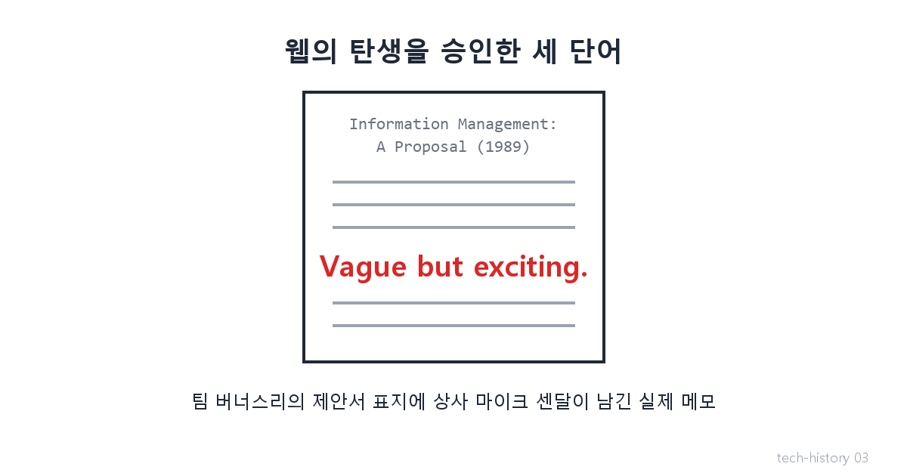
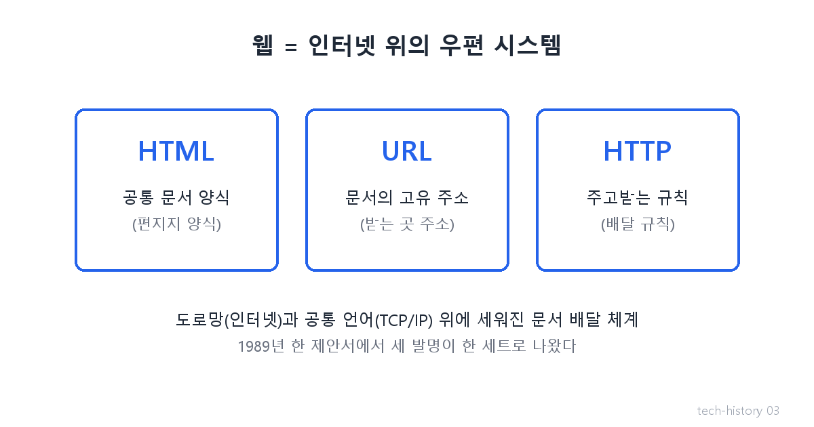

# [발행 3/11] "모호하지만 흥미로움" — Web의 탄생

- 원본: [01-frontend.md](./01-frontend.md) Part 1 중 Web · 발행: 3번째 (D+6) · 편성: [plan.md](./plan.md)

| # | 이미지 | 삽입 위치 |
|---|---|---|
| 1 | `images/03-1-vague-but-exciting.png` | 대표 (첫 첨부) |
| 2 | `images/03-2-web-trio.png` | 3요소 설명 직후 |

---

## LinkedIn 본문

[테크스토리 #03 | WWW의 탄생 — 웹을 승인한 메모 "모호하지만 흥미로움"]

월드와이드웹의 탄생 승인은, 상사가 제안서 표지에 휘갈긴 세 단어였습니다 — "모호하지만 흥미로움(Vague but exciting)".

기술의 역사를 "문제 → 해결 → 새로운 문제"의 연쇄로 풀어가는 시리즈, 3편입니다. (2편: 하루 만에 언어를 갈아탄 날, TCP/IP)
(등장인물과 대화는 이해를 돕기 위한 각색이며, 기술 내용은 모두 실제 기록입니다.)

1989년, 스위스 제네바의 유럽입자물리연구소 CERN.
수천 명의 연구자가 세계 최대 실험 장비를 돌리는 곳. 그런데 이곳의 진짜 고질병은 물리학이 아니었습니다.

신참: "3년 전 그 실험 데이터, 어디서 봅니까?"

고참: "담당자가 작년에 퇴사했지. 자료는 그 사람 컴퓨터에 있는데… 우리 시스템과 달라서 열어도 못 읽어."

신참: "그럼 그걸 아는 다른 분을…"

고참: "그 사람도 떠났어. 여긴 사람이 떠나면 지식도 같이 떠나."

이 답답함을 견디다 못한 한 영국인 연구원이 제안서를 씁니다. 제목은 소박했습니다 — "정보 관리: 하나의 제안". 핵심 아이디어는 한 줄이었습니다.

"문서 속 단어를 누르면, 관련된 다른 문서로 바로 건너뛰게 하자."

이 '건너뛰기'의 이름이 하이퍼링크입니다. 그리고 이를 위해 세 가지 발명이 한 세트로 나옵니다.

HTML — 문서를 쓰는 공통 양식 (편지지 양식)
URL — 문서마다 붙는 고유 주소 (주소)
HTTP — 문서를 주고받는 규칙 (배달 규칙)

지난 편들의 비유를 이으면: 인터넷이 도로망이고 TCP/IP가 공통 언어라면, 웹은 그 위에 세워진 우편 시스템입니다.

제안서를 받은 상사는 표지에 "모호하지만 흥미로움"이라 적고, 조용히 해볼 시간을 내줍니다. 연구원의 이름은 팀 버너스리, 상사는 마이크 센달 — 메모까지 전부 실화입니다. 1990년 말 첫 웹사이트가 CERN 안에서 돌아갔고, 1991년 세상에 공개됩니다.

그리고 1993년 4월 30일, CERN은 역사에 남을 결정을 합니다. 웹 기술 전체를 특허료 없이 누구나 쓰도록 풀어버린 겁니다. 오늘 여러분이 쓰는 모든 웹사이트, 쇼핑몰, 유튜브, 지금 이 링크드인까지 — 전부 그날 공짜가 된 기술 위에 서 있습니다. 그날 CERN이 사용료를 물렸다면 웹은 지금의 웹이 되지 못했을 겁니다.

모든 해결은 새로운 문제를 낳는다 — 웹도 예외가 아니었습니다. 초기 웹은 글자만 보였습니다. 사진 한 장 못 띄우는 밋밋한 문서였죠.

다음 편(#04): 그 밋밋한 웹에 그림을 띄운 대학 시급 알바생 — 그리고 그가 실리콘밸리에서 터뜨린, 나스닥을 2시간 마비시킨 상장. 3일에 한 편씩 이어집니다.

(대화는 각색입니다. 출처: 제안서 원문 info.cern.ch/Proposal.html / CNBC 2019.3.12 "Vague but exciting" / CERN 웹 퍼블릭 도메인 선언 1993.4.30)

© 2026 박정훈 · 전체 시리즈: github.com/nous-zero/tech-history

#기술의역사 #IT역사 #웹 #WWW #테크스토리

---

## X 본문 (이미지 03-1 첨부)

웹의 탄생 승인은 상사의 세 단어 메모였다 — "모호하지만 흥미로움".
1989년 제안서 한 장이 웹이 됐고, 1993년 CERN은 그걸 공짜로 풀었다.
오늘의 인터넷 경제 전체가 그 공짜 위에 서 있다. (3/11)
