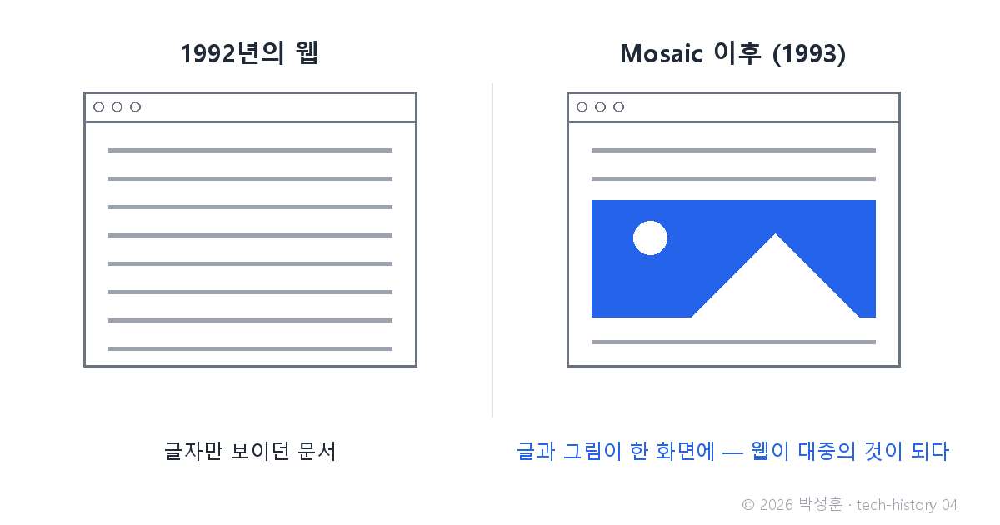
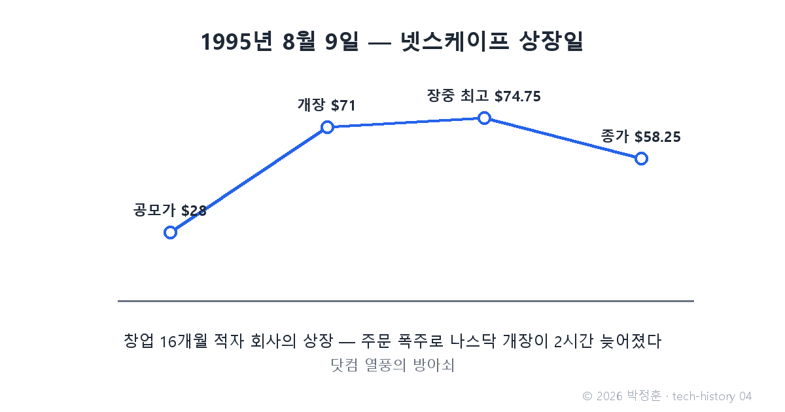

# [발행 4/11] 알바생이 연 그림의 시대 — Mosaic과 Netscape

- 원본: [01-frontend.md](./01-frontend.md) Part 2 중 Mosaic·Netscape · 발행: 4번째 (D+9) · 편성: [plan.md](./plan.md)

| # | 이미지 | 삽입 위치 |
|---|---|---|
| 1 | `images/04-1-text-vs-image-web.png` | 대표 (첫 첨부) |
| 2 | `images/04-2-netscape-ipo.png` | 상장 대목 직후 |

---

## LinkedIn 본문

[테크스토리 #04 | Mosaic·Netscape — 알바생의 브라우저가 나스닥을 마비시키다]

1995년 8월 9일. 창업 1년 4개월짜리 적자 회사가 상장하자, 주문이 폭주해 나스닥이 2시간 가까이 거래를 열지 못했습니다.

기술의 역사를 "문제 → 해결 → 새로운 문제"의 연쇄로 풀어가는 시리즈, 4편입니다. (3편: "모호하지만 흥미로움" — 웹의 탄생)
(등장인물과 대화는 이해를 돕기 위한 각색이며, 기술 내용은 모두 실제 기록입니다.)

이야기는 3년 전, 일리노이 대학의 슈퍼컴퓨팅 연구소 NCSA에서 시작합니다.

알바생: "웹 써봤어? 물건이야. 문제는 글자만 나온다는 거지."

동료: "연구 문서 읽는 도구인데 글자면 충분하잖아."

알바생: "보통 사람들은 그림 없는 건 안 봐. 문서에 그림을 같이 띄우자. 설치도 클릭 몇 번이면 되게 만들고."

1993년, 시급 알바생 마크 앤드리슨과 동료 에릭 비나가 만든 브라우저 Mosaic이 공개됩니다. 글과 그림이 한 화면에 — 지금 보면 당연한 이 장면이, 웹을 연구자의 도구에서 대중의 놀이터로 바꿨습니다.

문제: Mosaic은 대학 소유였고, 폭발하는 수요를 대학 연구소가 감당할 수 없었습니다.

해결: 앤드리슨은 졸업하자마자 실리콘밸리로 가서, 사업가 짐 클라크를 만나 1994년 넷스케이프를 창업합니다. 법적 시비를 피하려 Mosaic 코드를 한 줄도 안 쓰고 처음부터 새로 만들었죠. 출시 몇 달 만에 점유율 약 70~80%(조사기관별 상이).

그리고 1995년 8월 9일의 상장. 공모가 28달러 → 개장 71달러 → 장중 최고 74.75달러 → 종가 58.25달러.

이날은 '닷컴 열풍의 방아쇠'로 불립니다. 이익이 없어도 "인터넷"이라는 단어만으로 돈이 몰리는 시대가 열린 겁니다. 오늘의 AI 투자 열풍을 보며 이날을 떠올리는 사람이 많습니다(이 비교는 제 관찰입니다).

새로운 문제: 이 요란한 성공이 거인을 깨웠습니다. 시애틀의 마이크로소프트가 브라우저 시장을 응시하기 시작한 겁니다. 그리고 넷스케이프에는 숙제가 하나 더 있었습니다 — 웹은 여전히 클릭해도 반응이 없는 '전단지'였다는 것.

다음 편(#05): 마감 10일. 넷스케이프의 한 개발자가 열흘 만에 만든 언어가, 30년 뒤 세상에서 가장 널리 쓰이는 언어가 된 이야기. 3일에 한 편씩 이어집니다.

(대화는 각색입니다. 출처: NCSA Mosaic 공식 기록 / Washington Post 1995.8.10 / NPR "Netscape's IPO Anniversary")

© 2026 박정훈 · 전체 시리즈: github.com/nous-zero/tech-history

#기술의역사 #IT역사 #넷스케이프 #닷컴 #테크스토리

---

## X 본문 (이미지 04-2 첨부)

1995년 8월 9일, 창업 16개월 적자 회사가 상장하자 나스닥이 2시간 마비됐다.
공모가 28달러, 개장 71달러 — 닷컴 열풍의 방아쇠.
시작은 대학 알바생이 만든 '그림 보이는 브라우저'였다. (4/11)
