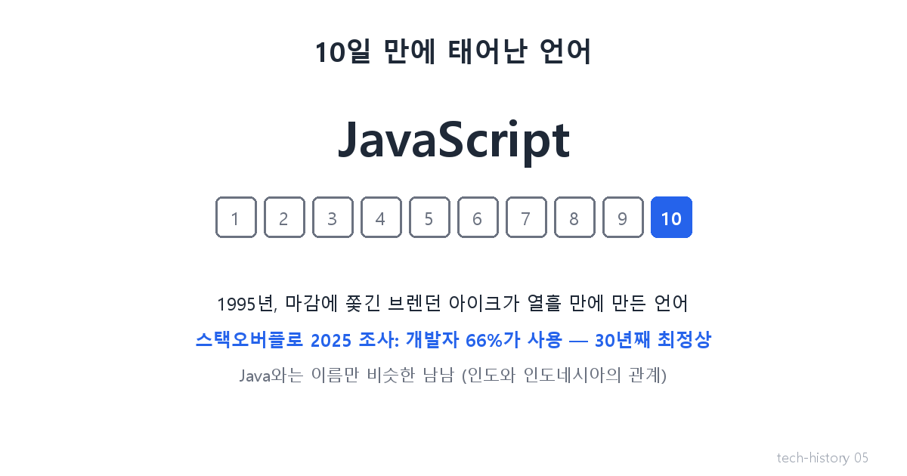

# [발행 5/11] 10일 만에 만든 언어 — JavaScript

- 원본: [01-frontend.md](./01-frontend.md) Part 2 중 JavaScript · 발행: 5번째 (D+12) · 편성: [plan.md](./plan.md)

| # | 이미지 | 삽입 위치 |
|---|---|---|
| 1 | `images/05-1-ten-days.png` | 대표 (첫 첨부) |
| 2 | `images/05-2-dom-map.png` | 원리 설명 직후 |

---

## LinkedIn 본문

[테크스토리 #05 | JavaScript — 마감 10일에 태어난 세계 1위 언어]

지금 세상에서 가장 널리 쓰이는 프로그래밍 언어는, 마감에 쫓겨 10일 만에 만들어졌습니다.

기술의 역사를 "문제 → 해결 → 새로운 문제"의 연쇄로 풀어가는 시리즈, 5편입니다. (4편: 알바생이 연 그림의 시대)
(등장인물과 대화는 이해를 돕기 위한 각색이며, 기술 내용은 모두 실제 기록입니다.)

1995년, 잘나가던 넷스케이프의 사무실.

기획: "웹의 다음 문제가 뭔지 알아? 클릭해도 아무 반응이 없다는 거야. 뭘 하든 서버까지 갔다 와야 해. 예쁜 전단지랑 다를 게 없어."

개발자: "브라우저 안에서 바로 실행되는 작은 언어를 심으면 됩니다. 버튼을 누르면 그 자리에서 화면이 반응하게요."

기획: "좋아. 그런데 다음 버전 마감이 코앞이야. …열흘 줄게."

그 개발자, 브렌던 아이크는 정말 10일 만에 언어의 뼈대를 완성합니다.

원리는 이렇습니다. 브라우저는 HTML을 읽는 순간 페이지의 모든 요소를 지도로 만들어 기억합니다 — 이 지도의 실제 이름이 DOM입니다. 새 언어는 이 지도를 보며 지시합니다. "이 버튼이 눌리면, 저 글자 색을 바꿔." 팝업, 입력 검사, 실시간 반응 — 웹이 드디어 '반응하는 물건'이 됐습니다.

이름의 흑역사도 있습니다. 처음엔 Mocha, 다음엔 LiveScript. 그런데 당시 최고 인기 언어였던 Java의 유명세에 편승하려 JavaScript로 개명합니다. 그래서 Java와 JavaScript는 이름만 비슷한 남남입니다 — 인도와 인도네시아 정도의 관계죠.

급조된 언어의 성적표: 스택오버플로(세계 최대 개발자 커뮤니티)의 2025년 조사에서 개발자 66%가 사용하는 언어, 2011년 이후 거의 매해 1위. 10일짜리 언어가 30년째 세상을 돌리고 있습니다.

새로운 문제: 물론 10일의 대가는 있었습니다. 급조된 설계의 허점들이 두고두고 개발자들을 괴롭히게 됩니다. 그리고 무엇보다 — 잘나가는 넷스케이프를 지켜보던 거인이, 드디어 움직입니다.

다음 편(#06): 마이크로소프트의 참전. 무기는 더 좋은 제품이 아니라 '끼워팔기'였다. 매일 한 편씩 이어집니다.

(대화는 각색입니다. 출처: Brendan Eich 회고(brendaneich.com) / "JavaScript: The First 20 Years", ACM HOPL IV 2020 / Stack Overflow Developer Survey 2025)

© 2026 박정훈 · 전체 시리즈: github.com/nous-zero/tech-history

#기술의역사 #IT역사 #자바스크립트 #JavaScript #테크스토리

---

## X 본문 (이미지 05-1 첨부)

세계에서 가장 널리 쓰이는 언어 JavaScript는 마감에 쫓겨 10일 만에 만들어졌다.
Java와는 이름만 비슷한 남남.
2025년 조사에서도 개발자 66%가 사용 — 10일짜리 언어가 30년째 세상을 돌린다. (5/11)
