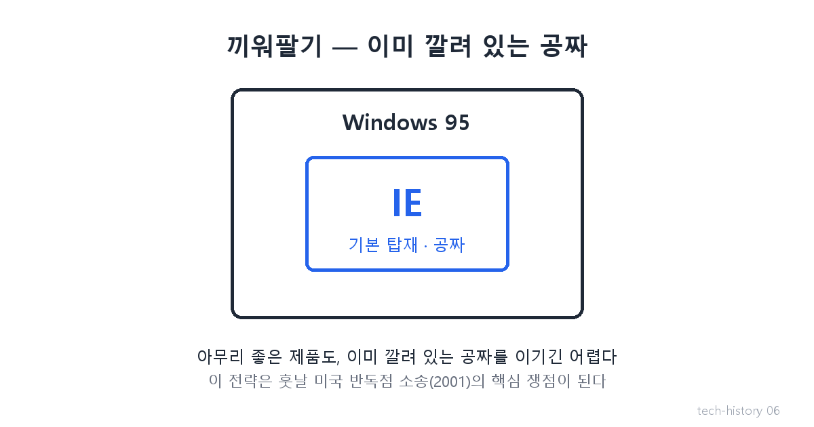
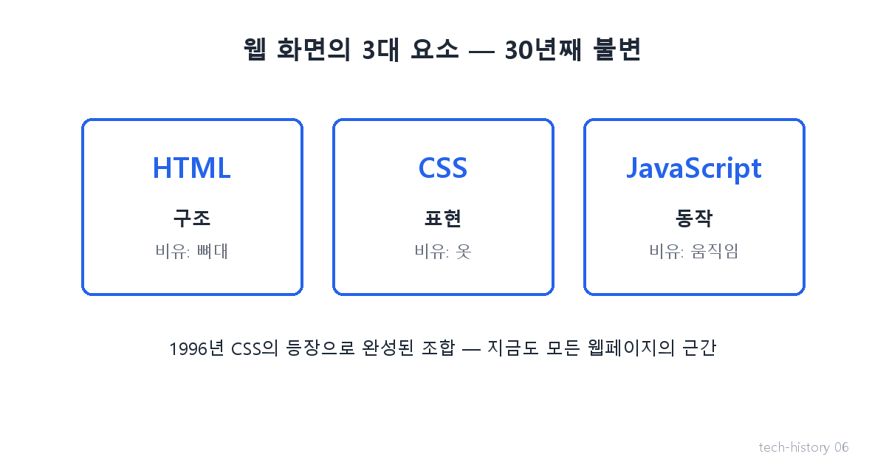

# [발행 6/11] 끼워팔기 전쟁 — IE와 CSS

- 원본: [01-frontend.md](../../01-frontend.md) Part 2 중 IE·CSS · 발행: 6번째 (D+15) · 편성: [plan.md](./plan.md)

| # | 이미지 | 삽입 위치 |
|---|---|---|
| 1 | `images/06-1-bundling.png` | 대표 (첫 첨부) |
| 2 | `images/06-2-html-css-js.png` | CSS 대목 직후 |

---

## LinkedIn 본문

[테크스토리 #06 | 끼워팔기 전쟁]

더 좋은 제품을 빨리 만들 수 없을 때, 거인은 유통으로 이깁니다.

기술의 역사를 "문제 → 해결 → 새로운 문제"의 연쇄로 풀어가는 시리즈, 6편입니다. (5편: 10일 만에 만든 언어)
(등장인물과 대화는 이해를 돕기 위한 각색이며, 기술 내용은 모두 실제 기록입니다.)

1995년, 시애틀의 마이크로소프트.

임원: "넷스케이프가 시장의 8할이야. 지금부터 브라우저를 처음부터 만들면 얼마나 걸리나?"

개발자: "몇 년입니다. 그때면 전쟁은 끝나 있을 겁니다."

임원: "그럼 만들지 말고 빌려 와. 그리고 우리의 진짜 무기를 쓴다 — 전 세계 컴퓨터 대부분에 깔리는 Windows에, 우리 브라우저를 공짜로 끼워 넣는 거야."

MS는 Mosaic 코드를 재라이선스받아 Internet Explorer를 만들고 Windows 95에 기본 탑재합니다. 아무리 넷스케이프가 좋아도, 이미 깔려 있는 공짜를 이기긴 어렵습니다. 이 끼워팔기는 훗날 미국 반독점 소송(2001년 판결)의 핵심 쟁점이 됩니다.

같은 시기, 화면 쪽에도 진전이 있었습니다. 1996년 CSS 표준의 등장 — HTML이 뼈대라면 CSS는 옷입니다. 문서의 구조와 꾸밈을 분리한 거죠. 이로써 웹 화면의 3대 요소가 완성됩니다: HTML(구조) + CSS(표현) + JavaScript(동작). 30년이 지난 지금도 이 셋이 웹의 근간입니다.

전쟁의 결말: 넷스케이프는 패배했고, 1998년 마지막 승부수로 소스 코드를 통째로 세상에 공개합니다. 이 유산이 Mozilla 프로젝트가 되고, 훗날 Firefox로 부활합니다 — 다음 편의 복선입니다.

새로운 문제: 전쟁 중 양측이 자기 브라우저에서만 되는 기능을 경쟁적으로 넣은 탓에, 같은 코드가 브라우저마다 다르게 보이는 지옥이 열렸습니다.

그리고 승자 IE의 최후는, 한국이 세계에서 가장 잘 압니다. 2022년 6월 15일 IE가 공식 지원 종료될 때까지 한국의 일부 공공·금융 사이트는 IE 전용 기술에 묶여 "IE로 접속하세요"를 안내하고 있었습니다. 독점의 유산은 기술이 죽은 뒤에도 관습으로 살아남습니다.

법칙: 유통으로 얻은 왕좌는 혁신을 멈추게 한다. 그리고 멈춘 왕좌는 반드시 도전받는다.

다음 편(#07): 패자의 유산 Firefox의 역습, 그리고 '속도'라는 새 무기를 든 Chrome의 등장. 3일에 한 편씩 이어집니다.

(대화는 각색입니다. 출처: U.S. v. Microsoft 판결 기록(2001) / W3C CSS1 권고안(1996) / Mozilla 프로젝트 연혁 / 컴퓨터월드·디지털데일리 IE 종료 보도(2022))

#기술의역사 #IT역사 #브라우저전쟁 #CSS #테크스토리

---

## X 본문 (이미지 06-1 첨부)

넷스케이프가 시장 8할을 쥐자 MS는 제품이 아니라 유통으로 반격했다 — Windows에 IE 공짜 끼워팔기.
승자가 된 IE는 혁신을 멈췄고, 2022년 한국의 "IE로 접속하세요"를 끝으로 사망했다. (6/11)
