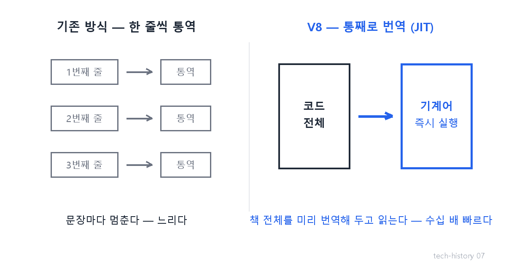
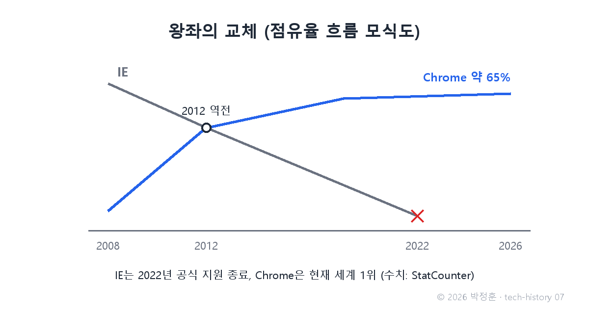

# [발행 7/11] 속도의 전쟁 — Firefox와 Chrome V8

- 원본: [01-frontend.md](./01-frontend.md) Part 2 중 2차 브라우저 전쟁 · 발행: 7번째 (D+18) · 편성: [plan.md](./plan.md)

| # | 이미지 | 삽입 위치 |
|---|---|---|
| 1 | `images/07-1-jit.png` | 대표 (첫 첨부) |
| 2 | `images/07-2-browser-share.png` | 결과 대목 직후 |

---

## LinkedIn 본문

[테크스토리 #07 | Chrome V8 — 속도로 왕좌를 뺏은 브라우저 전쟁 2라운드]

1등의 가장 무서운 적은 2등이 아니라, 1등이 된 뒤의 자기 자신입니다.

기술의 역사를 "문제 → 해결 → 새로운 문제"의 연쇄로 풀어가는 시리즈, 7편입니다. (6편: 끼워팔기 전쟁)
(등장인물과 대화는 이해를 돕기 위한 각색이며, 기술 내용은 모두 실제 기록입니다.)

2000년대 초, 왕좌에 오른 IE는 업데이트를 사실상 멈춥니다. 경쟁자가 없으니 서두를 이유도 없었죠. 웹 표준도 잘 안 지켰습니다. 개발자들의 원성이 쌓여갈 무렵, 두 번의 공격이 시작됩니다.

1차 공격(2004): 패자의 유산. 지난 편에서 넷스케이프가 공개한 소스 코드에서 태어난 Firefox가 "표준을 지키는 가벼운 브라우저"로 IE를 잠식하기 시작합니다.

결정타(2008): 구글의 회의실.

임원: "이제 와서 브라우저 전쟁에 들어간다고? 한참 늦었잖아."

개발자: "무기가 다릅니다. 기존 브라우저는 자바스크립트를 한 줄씩 통역합니다 — 한 문장 읽고, 통역하고, 또 읽고. 우리는 코드를 통째로 기계어로 번역해 놓고 실행합니다. 책 전체를 미리 번역해 두고 읽는 셈입니다."

이 엔진의 이름이 V8입니다. 실행 속도가 수십 배 빨라지자, 지메일·구글 문서 같은 무거운 웹 서비스가 앱처럼 돌아가기 시작했습니다.

결과: 2008년 출시된 Chrome은 2012년 IE를 추월했고(StatCounter 기준), 2026년 현재도 세계 점유율 약 65%로 1위입니다(StatCounter 2026.5). IE는 2022년 6월 공식 지원 종료로 퇴장했습니다.

그런데 V8의 진짜 유산은 브라우저 전쟁의 승리가 아닙니다. "이렇게 빠른 엔진을 브라우저 안에만 가둬둘 건가?"라는 질문을 낳은 것 — 이 질문이 다음 시대를 엽니다.

법칙: 독점의 안주가 도전자를 부르고, 도전자의 무기는 언제나 기존 왕이 무시하던 지표다. IE는 '기본 탑재'로 이겼고, '속도'로 죽었습니다.

다음 편(#08): 자바스크립트의 탈옥 — V8을 브라우저 밖으로 꺼낸 남자, 그리고 브라우저 사투리 지옥을 끝낸 통역사. 3일에 한 편씩 이어집니다.

(대화는 각색입니다. 출처: StatCounter Global Stats(2026.5) / Microsoft IE 지원 종료 공지(2022.6.15) / V8 공식 문서)

© 2026 박정훈 · 전체 시리즈: github.com/nous-zero/tech-history

#기술의역사 #IT역사 #크롬 #브라우저전쟁 #테크스토리

---

## X 본문 (이미지 07-1 첨부)

독점한 IE는 업데이트를 멈췄고, 2008년 크롬이 '속도'로 참전했다.
비결은 V8 — 한 줄씩 통역하던 코드를 통째로 번역.
2012년 왕좌를 뺏었고 지금도 점유율 65%. 기본 탑재로 이긴 왕은 속도로 죽었다. (7/11)
