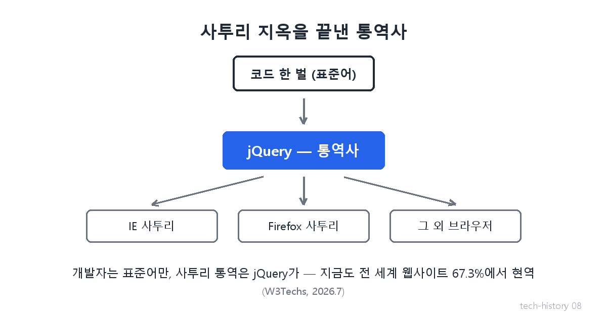
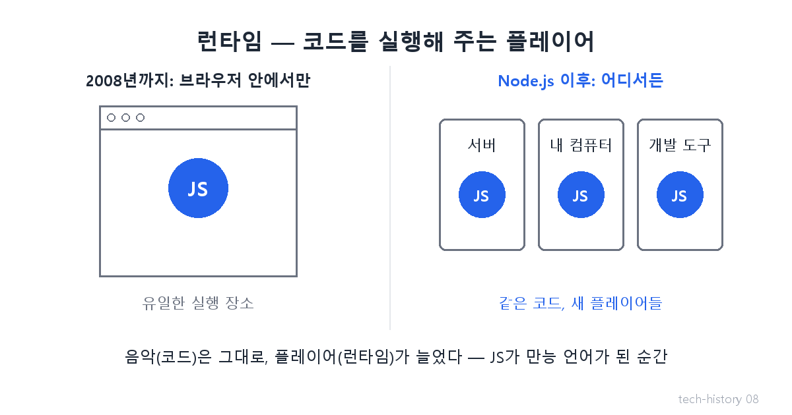

# [발행 8/11] 통역사와 탈옥 — jQuery와 Node.js

- 원본: [01-frontend.md](./01-frontend.md) Part 3 전환① · 발행: 8번째 (D+21) · 편성: [plan.md](./plan.md)

| # | 이미지 | 삽입 위치 |
|---|---|---|
| 1 | `images/08-1-jquery-translator.png` | 대표 (첫 첨부) |
| 2 | `images/08-2-runtime.png` | Node.js 대목 직후 |

---

## LinkedIn 본문

[테크스토리 #08 | jQuery·Node.js — 사투리 통역사와 자바스크립트의 탈옥]

스무 살 넘은 기술 하나가, 아직도 전 세계 웹사이트 3분의 2에서 돌아가고 있습니다.

기술의 역사를 "문제 → 해결 → 새로운 문제"의 연쇄로 풀어가는 시리즈, 8편입니다. (7편: 속도의 전쟁)
(등장인물과 대화는 이해를 돕기 위한 각색이며, 기술 내용은 모두 실제 기록입니다.)

2006년, 어느 개발 회사의 야근 풍경.

신입: "기능 하나 만드는데 왜 코드를 세 벌씩 짜요?"

선임: "IE용, 파이어폭스용, 그리고 나머지용. 브라우저 전쟁의 유산이야. 같은 명령도 브라우저마다 사투리가 달라서, 다 따로 말해줘야 해."

이 지옥을 끝낸 것이 2006년 존 레식이 공개한 jQuery입니다. 개발자는 표준어 한 벌만 쓰고, 브라우저별 사투리 통역은 jQuery가 대신합니다. 코드가 극적으로 짧아졌고, 웹 개발의 국민 도구가 됐습니다.

그리고 이 통역사는 아직도 은퇴하지 않았습니다. 2026년 7월 기준, 전 세계 웹사이트의 67.3%가 여전히 jQuery를 씁니다(W3Techs). 기술은 유행보다 훨씬 오래 삽니다 — 한번 깔린 기술은 좀처럼 걷히지 않으니까요.

한편 2009년, 더 큰 사건이 벌어집니다. 개발자 라이언 달의 질문은 지난 편의 복선 그대로였습니다.

"크롬 V8 엔진의 저 무시무시한 속도를, 브라우저 안에만 가둬둘 이유가 있나?"

그는 V8을 꺼내, 브라우저 없이 자바스크립트를 실행하는 Node.js를 만듭니다. 코드를 실행해 주는 판을 새로 만든 겁니다 — 음악 파일은 그대로인데 새 플레이어가 생긴 셈이죠(이 판의 전문용어가 '런타임'입니다).

이 '탈옥'으로 자바스크립트는 브라우저 전용 언어에서, 서버든 도구든 무엇이든 만드는 만능 언어가 됐습니다. 화면 만들던 개발자가 서버까지 넘보게 된 역사적 분기점입니다.

새로운 문제: 언어가 만능이 되자 전 세계에서 코드 부품(라이브러리)이 폭발적으로 쏟아졌습니다. 그런데 이 부품들을 저장하고 나눠 쓸 체계가 없었습니다.

다음 편(#09): 부품 창고의 탄생 — 그리고 11줄짜리 부품 하나가 지워지자 페이스북과 넷플릭스가 멈춘 날. 매일 한 편씩 이어집니다.

(대화는 각색입니다. 출처: jquery.com 공식 연혁 / W3Techs jQuery 사용 통계(2026.7, 전체 웹사이트의 67.3%) / Ryan Dahl, JSConf EU 2009)

© 2026 박정훈 · 전체 시리즈: github.com/nous-zero/tech-history

#기술의역사 #IT역사 #jQuery #NodeJS #테크스토리

---

## X 본문 (이미지 08-1 첨부)

브라우저마다 사투리가 달라 코드를 세 벌씩 짜던 시대를 jQuery가 끝냈다 — 20년이 지난 지금도 전 세계 웹사이트 67%에서 현역.
2009년엔 V8을 브라우저 밖으로 꺼낸 Node.js가 JS를 만능 언어로 만들었다. (8/11)
