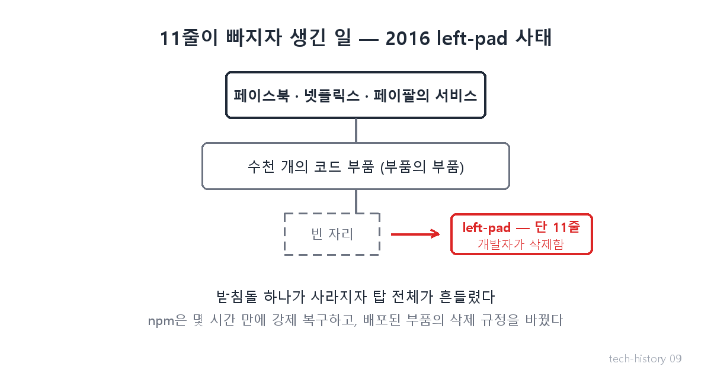
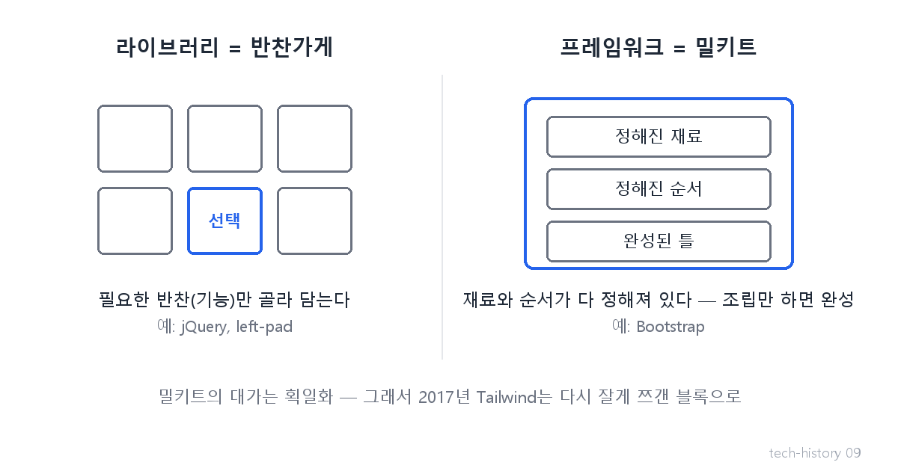

# [발행 9/11] 레고와 밀키트 — npm·Bootstrap·Tailwind

- 원본: [01-frontend.md](./01-frontend.md) Part 3 전환② · 발행: 9번째 (D+24) · 편성: [plan.md](./plan.md)

| # | 이미지 | 삽입 위치 |
|---|---|---|
| 1 | `images/09-1-leftpad-jenga.png` | 대표 (첫 첨부) |
| 2 | `images/09-2-library-vs-framework.png` | Bootstrap 대목 직후 |

---

## LinkedIn 본문

[테크스토리 #09 | npm left-pad 사태 — 11줄이 지워지자 페이스북이 멈췄다]

2016년 3월 22일, 11줄짜리 코드가 인터넷에서 지워졌습니다. 그러자 페이스북·넷플릭스·페이팔의 개발이 멈췄습니다.

기술의 역사를 "문제 → 해결 → 새로운 문제"의 연쇄로 풀어가는 시리즈, 9편입니다. (8편: 통역사와 탈옥)
(등장인물과 대화는 이해를 돕기 위한 각색이며, 기술 내용은 모두 실제 기록입니다.)

이 황당한 사건을 이해하려면 2010년으로 돌아가야 합니다.

지난 편에서 자바스크립트가 만능 언어가 되자 코드 부품이 폭발했다고 했죠. 문제는 창고가 없었다는 것.

해결: 2010년 npm의 등장 — 전 세계 개발자의 코드 부품이 등록되는 중앙 창고입니다. 명령 한 줄이면 남이 만든 부품이 내 프로젝트에 설치됩니다. 프로그래밍 세계의 앱스토어인 셈이죠.

이 창고가 개발의 본질을 바꿨습니다. 맨땅에 처음부터 짓기 → 검증된 부품을 가져다 조립하기(레고). 오늘날 AI가 몇 분 만에 서비스를 만들어내는 것도, 바로 이 조립식 부품 생태계 위에서 돌아가기 때문입니다.

디자인도 같은 길을 갔습니다. 2011년 트위터 개발자들이 공개한 Bootstrap은 '디자인 밀키트' — 재료와 순서가 정해져 있어 조립만 하면 그럴듯한 화면이 나옵니다.
새로운 문제: 모두가 같은 밀키트를 쓰니 웹사이트가 전부 비슷해졌습니다.
해결: 2017년 Tailwind — 완성된 밀키트 대신 잘게 쪼갠 레고 블록으로, 디자인의 자유를 되찾습니다.

그리고 2016년의 그 사건. 한 개발자가 회사와의 이름 분쟁 끝에, 자신이 창고에 올렸던 부품 전부를 삭제해버립니다. 그중 하나가 left-pad — 문자열 왼쪽에 빈칸을 채워주는 단 11줄짜리 부품이었습니다. 그런데 수천 개의 유명 부품들이 부품의 부품으로 이 11줄에 의존하고 있었고, 연쇄적으로 전 세계의 개발이 무너졌습니다. npm은 몇 시간 만에 해당 부품을 강제 복구했고, 이후 배포된 부품을 함부로 못 지우게 규정을 바꿨습니다.

법칙: 조립식의 대가는 의존성이다. 내 서비스의 운명이 얼굴도 모르는 개발자의 11줄에 걸려 있을 수 있다. 레고로 지은 집은 빨리 올라가지만, 블록 하나가 빠지면 어디까지 무너질지 아무도 모른다.

다음 편(#10): 부품은 갖췄는데 화면 갱신은 여전히 수작업이었다 — "데이터만 고쳐라, 화면은 내가 알아서 바꾼다"는 페이스북의 발상 전환, React. 3일에 한 편씩 이어집니다.

(대화는 각색입니다. 출처: npmjs.com / Wikipedia "npm left-pad incident" / The Register 2016.3.23)

© 2026 박정훈 · 전체 시리즈: github.com/nous-zero/tech-history

#기술의역사 #IT역사 #npm #오픈소스 #테크스토리

---

## X 본문 (이미지 09-1 첨부)

2016년, 11줄짜리 코드가 지워지자 페이스북·넷플릭스의 개발이 멈췄다.
개발이 '레고 조립'이 된 시대의 대가 — 내 서비스의 운명이 얼굴도 모르는 개발자의 11줄에 걸려 있다. (9/11)
