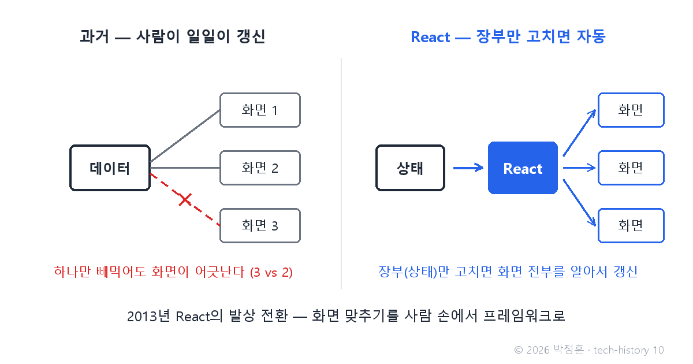
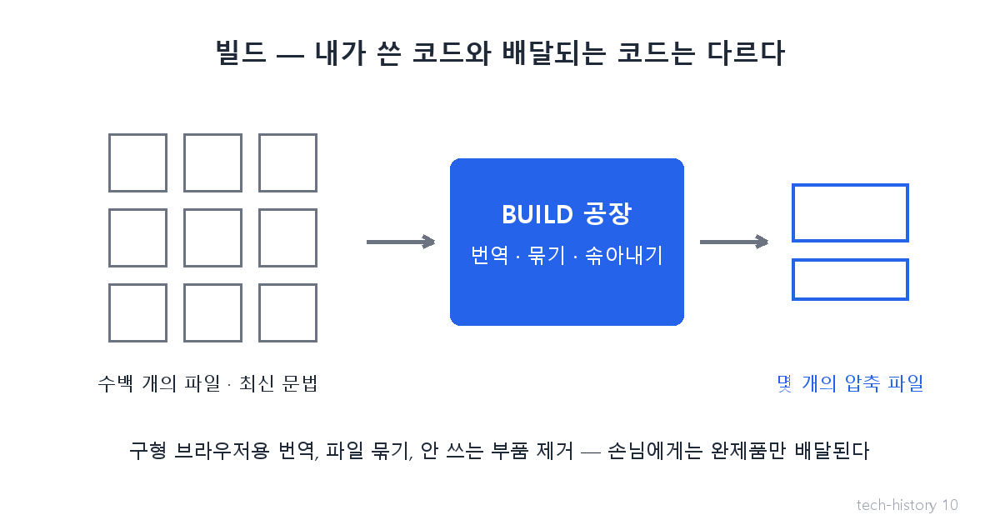

# [발행 10/11] 알아서 바뀌는 화면 — React와 빌드

- 원본: [01-frontend.md](./01-frontend.md) Part 3 전환③ · 발행: 10번째 (D+27) · 편성: [plan.md](./plan.md)

| # | 이미지 | 삽입 위치 |
|---|---|---|
| 1 | `images/10-1-state-auto.png` | 대표 (첫 첨부) |
| 2 | `images/10-2-build-factory.png` | 빌드 대목 직후 |

---

## LinkedIn 본문

[테크스토리 #10 | React — 장부만 고치면 화면은 알아서 바뀐다]

"장부만 고쳐라. 진열장은 내가 알아서 바꾼다" — 2013년, 페이스북이 웹 개발의 문법을 뒤집었습니다.

기술의 역사를 "문제 → 해결 → 새로운 문제"의 연쇄로 풀어가는 시리즈, 10편입니다. (9편: 레고와 밀키트)
(등장인물과 대화는 이해를 돕기 위한 각색이며, 기술 내용은 모두 실제 기록입니다.)

2012년 무렵, 어느 서비스 회사.

개발자: "또 알림 숫자 버그예요. 메시지를 다 읽었는데 위엔 3, 옆엔 2로 떠요."

선임: "같은 숫자가 화면 세 군데 뜨잖아. 데이터가 바뀔 때마다 세 군데를 각각 고치는 코드를 짜야 하는데, 하나만 빼먹어도 저 꼴이 나."

개발자: "기능이 늘수록 고칠 곳도 늘어나는데, 그걸 사람이 다 기억한다고요?"

못 합니다. 그게 문제의 핵심이었습니다. 화면(보이는 것)과 데이터(진짜 값)를 맞추는 일을 사람 손에 맡기면, 서비스가 커질수록 반드시 어긋납니다.

해결: 2013년 페이스북이 공개한 React의 발상 전환 — 개발자는 상태(앱이 기억해야 할 데이터 장부)만 관리하라. 장부가 바뀌면 화면은 React가 알아서 갱신한다. 진열장 정리를 점원에게 맡기고 주인은 장부만 쓰는 겁니다. 여기에 잘 만든 화면 조각을 레고처럼 재사용하는 개념(컴포넌트)이 더해져, 화면 개발 자체가 조립 산업이 됐습니다.

숨은 조력자도 있습니다 — 빌드. 이 시대의 코드는 우리가 쓴 그대로 서비스에 올라가지 않습니다. 공장을 한 번 거칩니다. 최신 문법을 구형 브라우저용으로 번역하고, 수백 개 파일을 몇 개로 묶고, 안 쓰는 부품을 솎아냅니다. "내가 쓰는 코드"와 "손님에게 배달되는 코드"가 달라진 겁니다.

현대 사례: 스택오버플로 2025년 조사에서 전문 개발자의 약 45%가 React를 사용합니다 — 화면 만들기 도구 중 1위. 여러분이 매일 쓰는 서비스 화면의 상당수가 이 방식 위에 서 있습니다.

새로운 문제: 화면 갱신은 해결됐는데, 사람들의 욕심은 더 커졌습니다. "웹도 앱처럼 매끄러울 순 없나?" — 이 욕심이 마지막 전쟁을 부릅니다.

다음 편(#11·완결): 앱처럼 매끄러워진 웹이 잃어버린 것, 그리고 카톡 링크 미리보기 한 장에 담긴 30년의 결말. 매일 한 편씩 이어집니다.

(대화는 각색입니다. 출처: React 공식 블로그 "Why did we build React?"(2013) / Stack Overflow Developer Survey 2025 / webpack·Vite 공식 문서)

© 2026 박정훈 · 전체 시리즈: github.com/nous-zero/tech-history

#기술의역사 #IT역사 #React #테크스토리

---

## X 본문 (이미지 10-1 첨부)

"장부(데이터)만 고쳐라, 진열장(화면)은 내가 바꾼다" — 2013년 React의 발상 전환.
화면 맞추기를 사람 손에서 프레임워크로 넘기자 웹 개발이 조립 산업이 됐다.
지금도 개발자 45%가 쓰는 1위 도구. (10/11)
